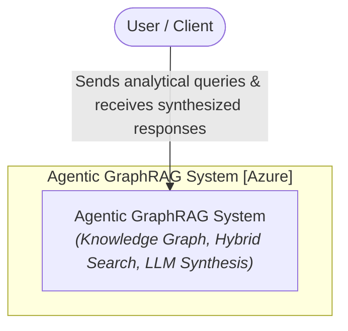
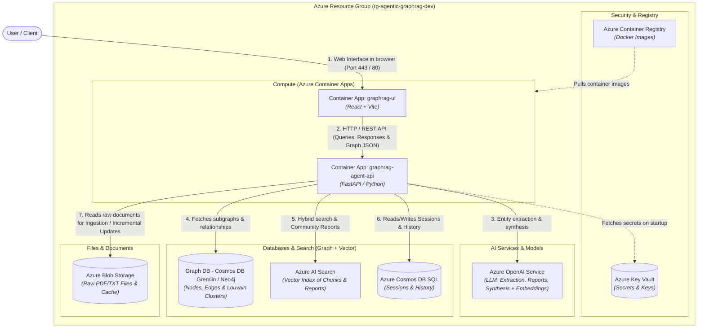
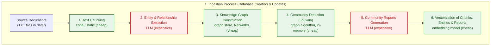
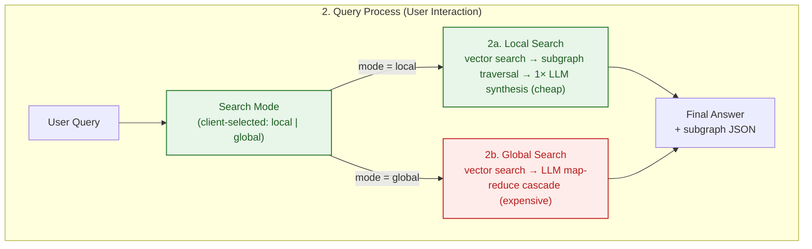

## Agentic GraphRAG Blueprint
A reference architecture for an Agentic GraphRAG (Knowledge Graph + Vector Search) solution deployed on Microsoft Azure using Terraform (IaC), FastAPI, and React.

This repository is a ready-made starting point for building systems that answer questions over large, unstructured document collections. Unlike plain retrieval, which returns isolated snippets, it combines a knowledge graph with vector search so an agent can connect facts across many documents - for example, tracing how a topic in one report relates to findings in another. Ingestion is incremental, so the corpus can grow without reprocessing everything from scratch and without exploding token costs.

It is most useful in knowledge-heavy domains where answers depend on cross-document synthesis rather than a single match: scientific and medical literature, legal and regulatory documents, product and incident documentation, and research workflows that ask "how do these things relate?" instead of "where is this phrase?".

The design aims to fit into the future. The agentic local/global search routing adapts to the complexity of each question. The store abstractions (`AbstractGraphStore`, `AbstractVectorStore`) keep the vector and graph backends swappable as needs evolve. The whole stack is defined in Terraform with a CI/CD pipeline, so moving from prototype to a scalable deployment on Azure is possible. As document corpora keep growing and LLM costs keep falling, knowledge-graph-based retrieval is where RAG is headed.

<div align="center">
  
  <p><em>The Agentic GraphRAG application UI</em></p>
</div>

## Architecture (C4 Model)
### Level 1: System Context Diagram
High-level overview of user interaction with the Agentic GraphRAG system.



### Level 2: Container Diagram
View of infrastructure components mapped to Azure resources defined via Terraform.



## Processing Workflows

### 1. Ingestion Process (Database Creation & Incremental Updates)



### 2. Query Process (User Interaction)


## Core Features

- Incremental ingestion: New documents are chunked, extracted into entities and relations, and merged into the knowledge graph without re-processing existing files. Louvain re-clustering runs in memory, and community reports are regenerated only for affected communities, keeping LLM token costs low as the corpus grows.

- Hybrid retrieval: Each query can use Local Search (vector search plus entity-level graph traversal for detailed, fact-level answers) or Global Search (map-reduce summarization over community reports for cross-document synthesis).

- Knowledge graph + vector index: Documents become a graph of entities and relations backed by NetworkX, alongside a ChromaDB vector index over chunks, entities, and reports. Both stores are swappable through `AbstractGraphStore` and `AbstractVectorStore`.

- Interactive graph visualizer: Subgraphs returned by search are rendered live in the UI, so you can inspect how an answer was assembled.

## Simple Start

The repository ships with a runnable prototype: a FastAPI backend (`backend/`) and a React frontend (`frontend/`).

### Prerequisites
- `OPENAI_API_KEY` in the root `.env` file (copy of `.env.example`)

### Run

```bash
docker compose up --build
```

- Frontend UI: http://localhost:5173
- Backend API: http://localhost:8000 (docs at `/docs`)

To remove everything locally (containers, images, volumes):

```bash
docker compose down --rmi all -v --remove-orphans
```

## Cloud Deployment

The reference architecture deploys to Azure with Terraform. No data is ingested in the cloud - the resources are provisioned empty and ready for you to load documents from the UI.

### Local deployment

```bash
make bootstrap   # creates the state backend and service principal
make apply       # provisions the whole environment
```

Using GitHub Actions instead: run `make bootstrap`, copy the printed values into **Settings → Secrets and variables → Actions**, and push to `main` - the workflow provisions Azure and deploys the backend and frontend images.

Teardown: `make destroy-all` removes all resources, the state backend, and the service principal.

> [!NOTE]
> The frontend uses Entra ID authentication, so the service principal needs the `Application.ReadWrite.All` Graph permission before the first apply - `make bootstrap` grants it automatically.

## Citation

If this repository has helped you during your research, feel free to cite it:

**APA Style**
> Brzustowicz, S. (2026). Agentic GraphRAG Blueprint: knowledge graphs and vector search for agentic question answering (Version 1.0.0) [Source code]. https://github.com/sebastianbrzustowicz/Agentic-GraphRAG-Blueprint

**BibTeX**
```bibtex
@software{brzustowicz_agentic_graphrag_blueprint_2026,
  author = {Sebastian Brzustowicz},
  title = {Agentic GraphRAG Blueprint: knowledge graphs and vector search for agentic question answering},
  url = {https://github.com/sebastianbrzustowicz/Agentic-GraphRAG-Blueprint},
  version = {1.0.0},
  year = {2026}
}
```
> [!TIP]
> You can also use the **"Cite this repository"** button in the sidebar to automatically copy these citations or download the raw metadata file.

## License

Agentic-GraphRAG-Blueprint is released under the MIT license.

## Author

Sebastian Brzustowicz &lt;Se.Brzustowicz@gmail.com&gt;