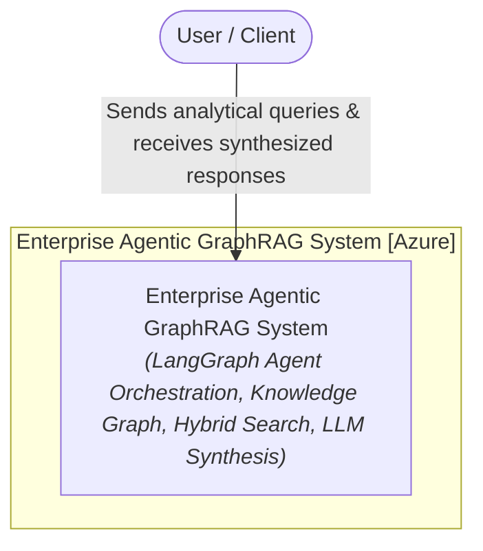
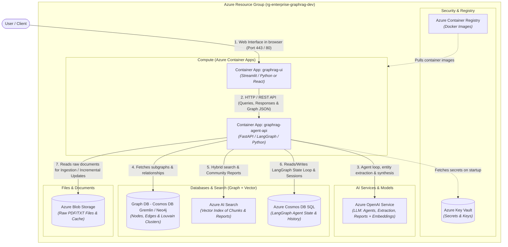
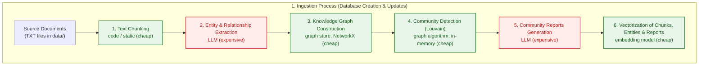
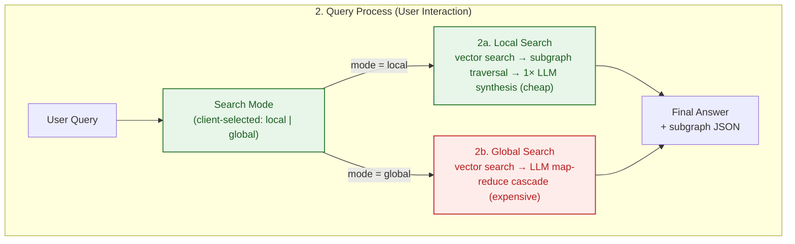

## Enterprise Agentic GraphRAG Infrastructure
An enterprise-grade reference architecture for an Agentic GraphRAG (Knowledge Graph + Vector Search) solution deployed on Microsoft Azure using Terraform (IaC), LangGraph, FastAPI, and Streamlit/React.

## Architecture (C4 Model)
### Level 1: System Context Diagram
High-level overview of user interaction with the Enterprise Agentic GraphRAG system.



### Level 2: Container Diagram
View of infrastructure components mapped to Azure resources defined via Terraform.



## Core Features & Incremental Ingestion
- Incremental Document Upload: Supports delta ingestion. New documents undergo entity/relationship extraction without re-processing existing files. The system merges new nodes/edges into the Knowledge Graph, runs Louvain re-clustering in memory, and triggers LLM Community Summarization only for affected communities, minimizing API token costs.

- Agentic Routing (LangGraph): Dynamically chooses between Local Search (entity-level traversing for detailed facts) and Global Search (hierarchical Map-Reduce summarization for cross-document synthesis).

- Interactive Graph Visualizer: Renders subgraphs and agent execution trajectories in real time within the UI container.

## Processing Workflows

### 1. Ingestion Process (Database Creation & Incremental Updates)



### 2. Query Process (User Interaction)


## Local Prototype — Running the App

The repository contains a runnable prototype: `backend/` (FastAPI + NetworkX + ChromaDB + OpenAI) and `frontend/` (React + Vite + MUI Joy + react-force-graph-2d).

### Prerequisites
- `OPENAI_API_KEY` present in the root `.env` file (models used: `gpt-4o-mini`, `text-embedding-3-small`).
- Input documents in `data/` (TXT files). The knowledge graph persists in `data/graph.gpickle`, the vector index in `.chroma_db/`.

### Option A — Docker Compose (recommended)

```bash
docker compose up --build
```

- Frontend UI: http://localhost:5173
- Backend API: http://localhost:8000 (docs at `/docs`)
- The frontend talks to the backend through the Vite dev proxy (`/api` → `http://backend:8000`) on the internal Docker network `graphrag-net`.
- Volumes persist `./data` and `./.chroma_db` between container restarts.

### Option B — Local development

Backend (from the repository root):

```bash
python -m venv .venv
.venv/bin/pip install -r backend/requirements.txt
cd backend
../.venv/bin/uvicorn app:app --host 0.0.0.0 --port 8000
```

Frontend (in a second terminal):

```bash
cd frontend
npm install
npm run dev
```

### API endpoints

| Method | Path        | Description                                              |
| ------ | ----------- | -------------------------------------------------------- |
| POST   | `/ingest`   | Run the full ingestion pipeline (chunk → extract → graph → communities → reports) |
| POST   | `/query`    | `{"query": "...", "mode": "local" \| "global"}` → `{answer, subgraph}` |
| POST   | `/upload`   | Multipart upload of a `.txt` file into `data/`           |
| GET    | `/stats`    | Node / edge / vector-document counts                     |
| GET    | `/health`   | Liveness probe                                           |

### Repository Pattern (migration path)

`backend/src/storage/base.py` defines `AbstractGraphStore` and `AbstractVectorStore`. `NetworkXGraphStore` (→ Azure Cosmos DB Gremlin) and `ChromaVectorStore` (→ Azure AI Search) implement them; `ingestion.py` and `search.py` depend only on the abstractions, so the Azure migration is a drop-in replacement of the two store classes.
