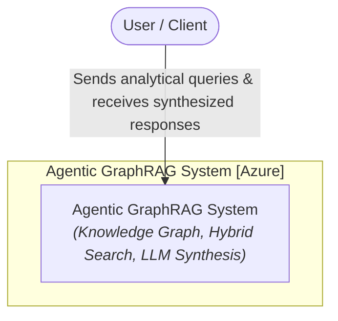
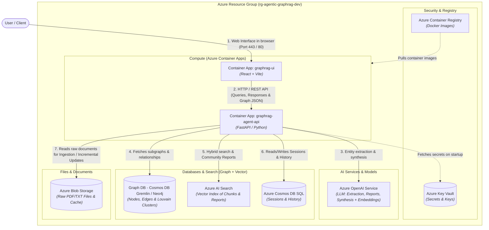
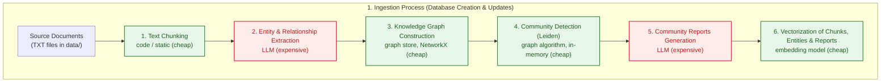
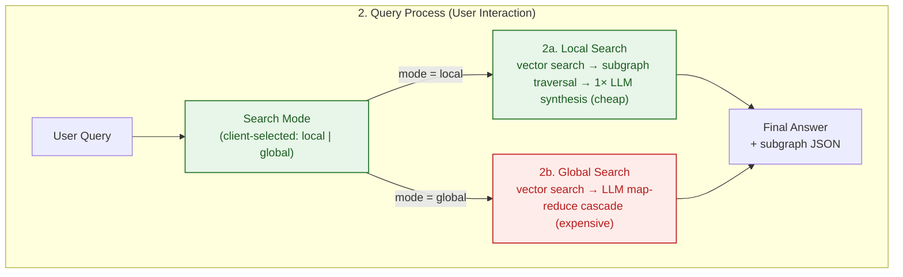

<p align="center">
  <a href="../README.md">English</a> ·
  <a href="README.zh-CN.md">中文</a> ·
  <a href="README.pl.md">Polski</a> ·
  <a href="README.es.md">Español</a> ·
  <a href="README.ja.md">日本語</a> ·
  <a href="README.ko.md">한국어</a> ·
  <a href="README.ru.md">Русский</a> ·
  <a href="README.fr.md">Français</a> ·
  <strong>Deutsch</strong>
</p>

## Agentic GraphRAG Blueprint

Referenzarchitektur für eine Agentic-GraphRAG-Lösung (Wissensgraph + Vektorsuche), bereitgestellt auf Microsoft Azure mit Terraform (IaC), FastAPI und React.

Dieses Repository ist ein gebrauchsfertiger Ausgangspunkt für Systeme, die Fragen zu großen, unstrukturierten Dokumentbeständen beantworten. Anders als einfache Suche, die isolierte Schnipsel zurückgibt, kombiniert es einen Wissensgraph mit Vektorsuche, sodass ein Agent Fakten über viele Dokumente hinweg verbinden kann - etwa nachverfolgen, wie ein Thema aus einem Bericht mit Erkenntnissen aus einem anderen zusammenhängt. Die Aufnahme ist inkrementell, sodass der Korpus wachsen kann, ohne alles von Grund auf neu zu verarbeiten und ohne explodierende Token-Kosten.

Am nützlichsten ist es in wissensintensiven Bereichen, in denen Antworten von einer domänenübergreifenden Synthese abhängen und nicht von einem einzelnen Treffer: wissenschaftliche und medizinische Literatur, Rechts- und Regulierungsdokumente, Produkt- und Incident-Dokumentation sowie Forschungsworkflows, die fragen „wie hängen diese Dinge zusammen?" statt „wo steht dieser Satz?".

Das Design zielt darauf ab, in die Zukunft zu passen. Das agentische Local/Global-Routing passt sich der Komplexität jeder Frage an. Die Store-Abstraktionen (`AbstractGraphStore`, `AbstractVectorStore`) halten die Graph- und Vektor-Backends austauschbar, während sich Anforderungen entwickeln. Der gesamte Stack ist in Terraform mit einer CI/CD-Pipeline definiert, sodass der Weg vom Prototyp zu einer skalierbaren Bereitstellung auf Azure möglich ist. Während Dokumentkorpora weiter wachsen und die LLM-Kosten weiter sinken, ist graphbasierte Suche die Richtung, in die RAG geht.

<div align="center">
  
  <p><em>Die Agentic-GraphRAG-Anwendungsoberfläche</em></p>
</div>

## Architektur (C4-Modell)
### Ebene 1: Systemkontextdiagramm
Überblick über die Interaktion des Benutzers mit dem Agentic-GraphRAG-System.



### Ebene 2: Containerdiagramm
Ansicht der Infrastrukturkomponenten, abgebildet auf in Terraform definierte Azure-Ressourcen.



## Verarbeitungsabläufe

### 1. Aufnahmeprozess (Datenbankerstellung & inkrementelle Aktualisierungen)



### 2. Abfrageprozess (Benutzerinteraktion)



### Kosten & Komplexität auf einen Blick

Die Kosten werden von LLM-Aufrufen dominiert; lokale Schritte (Chunking, Graphalgorithmen, Embeddings) sind in dieser Größenordnung praktisch kostenlos.

| Schritt | Kostentreiber | Relative Kosten |
|---|---|---|
| Text-Chunking | CPU, O(Zeichen) | vernachlässigbar |
| Entitäts- & Beziehungsextraktion | LLM-Token, ein Aufruf pro Chunk | hoch (Hauptkosten) |
| Wissensgraph-Aufbau | CPU, im Speicher | vernachlässigbar |
| Community-Erkennung (Leiden) | CPU, ~linear zu Kanten | vernachlässigbar |
| Community-Berichte | LLM-Token, pro Community | hoch |
| Embeddings | Token + API-Aufrufe, gebündelt | niedrig |
| Lokale Abfrage | 1 LLM-Syntheseaufruf | niedrig |
| Globale Abfrage | LLM-Map-Reduce-Kaskade | mittel-hoch |

- **Die Aufnahmekosten wachsen mit der Zahl *geänderter* Dateien**, nicht mit der Korpusgröße: unveränderte Dokumente werden per Inhalts-Hash übersprungen, und Community-Berichte werden nur für betroffene Communities neu erzeugt.
- **Die Abfragekosten wachsen mit der Frage**, nicht mit der Korpusgröße: `local` kostet ~1 LLM-Aufruf, `global` eine kleine Map-Reduce-Kaskade über die relevantesten Berichte.

## Kernfunktionen

- Inkrementelle Aufnahme: neue Dokumente werden gechunkt, in Entitäten und Beziehungen extrahiert und in den Wissensgraph eingefügt, ohne bestehende Dateien erneut zu verarbeiten. Das Leiden-Reclustering läuft im Speicher, und Community-Berichte werden nur für betroffene Communities neu erzeugt - so bleiben die LLM-Tokenkosten niedrig, während der Korpus wächst.

- Hybride Suche: Jede Abfrage kann die lokale Suche (Vektorsuche plus Graphtraversierung auf Entitätsebene für detaillierte Faktenantworten) oder die globale Suche (Map-Reduce-Zusammenfassung über Community-Berichte für domänenübergreifende Synthese) verwenden.

- Wissensgraph + Vektorindex: Dokumente werden zu einem Graphen aus Entitäten und Beziehungen auf Basis von NetworkX, neben einem ChromaDB-Vektorindex über Chunks, Entitäten und Berichte. Beide Stores sind über `AbstractGraphStore` und `AbstractVectorStore` austauschbar.

- Domänenunabhängige Prompts: Alle LLM-Systemprompts (Extraktion, Community-Berichte, lokale/globale Suche) liegen in `backend/prompts.json` mit universellen Standardwerten. Kopieren Sie die Datei, bearbeiten Sie die `system`-Strings und setzen Sie `PROMPTS_PATH`, um den Assistenten an jede Domäne anzupassen.

- Interaktiver Graph-Visualizer: Von der Suche zurückgegebene Teilgraphen werden live in der Oberfläche gerendert, sodass Sie prüfen können, wie eine Antwort zusammengesetzt wurde.

## Schnellstart

Das Repository enthält einen lauffähigen Prototyp: ein FastAPI-Backend (`backend/`) und ein React-Frontend (`frontend/`).

### Voraussetzungen
- `OPENAI_API_KEY` in der `.env`-Datei im Stammverzeichnis (Kopie von `.env.example`)

### Ausführen

```bash
docker compose up --build
```

- Frontend-UI: http://localhost:5173
- Backend-API: http://localhost:8000 (Doku unter `/docs`)

Um lokal alles zu entfernen (Container, Images, Volumes):

```bash
docker compose down --rmi all -v --remove-orphans
```

## Cloud-Bereitstellung

Die Referenzarchitektur wird mit Terraform auf Azure bereitgestellt. In der Cloud werden keine Daten aufgenommen - die Ressourcen werden leer provisioniert und sind bereit, Dokumente über die Oberfläche zu laden.

### Lokale Bereitstellung

```bash
make bootstrap   # erstellt State-Backend und Service Principal
make apply       # provisioniert die gesamte Umgebung
```

Alternativ über GitHub Actions: `make bootstrap` ausführen, die ausgegebenen Werte in **Settings → Secrets and variables → Actions** kopieren und auf `main` pushen - der Workflow provisioniert Azure und stellt die Backend- und Frontend-Images bereit.

Ein normaler Push führt nur den Lint-&-Test-Job aus. `[cloud]` im Commit-Text führt zusätzlich Terraform aus und stellt auf Azure bereit; `[skip ci]` überspringt die Pipeline komplett, und reine Dokumentänderungen (`README.md`, `images/`, `data/`, `Makefile`) werden automatisch herausgefiltert. Verwenden Sie den Button **Run workflow** im Actions-Tab, um manuell bereitzustellen.

Teardown: `make destroy-all` entfernt alle Ressourcen, das State-Backend und den Service Principal.

> [!NOTE]
> Das Frontend verwendet die Entra-ID-Authentifizierung, daher benötigt der Service Principal vor dem ersten apply die Graph-Berechtigung `Application.ReadWrite.All` - `make bootstrap` gewährt sie automatisch.

## Mögliche zukünftige Verbesserungen

Die Architektur lässt bewusst Spielraum für Änderungen, die sich lohnen, sobald Modellkosten weiter sinken und Kontextfenster weiter wachsen:

- **Semantische Entitätsauflösung**: heute werden Entitäten zusammengeführt, wenn das Modell denselben Namen wiederverwendet. Günstigere Modelle machen einen dedizierten Auflösungslauf (Synonyme, Akronyme, Transliterationen) erschwinglich und vereinen weit mehr Knoten über Dokumente hinweg.
- **Abfrage-Zerlegung und Multi-Hop-Reasoning**: komplexe Fragen in Teilabfragen zerlegen, die gegen verschiedene Graphenregionen beantwortet werden, und dann synthetisieren. Mehr LLM-Aufrufe pro Abfrage, aber deutlich bessere Antworten auf zusammengesetzte Fragen.
- **Evaluations-Harness**: ein Offline-Benchmark (Fragesätze + Referenzantworten), um zu quantifizieren, wie sich Extraktions-, Such- und Prompt-Änderungen auf die Antwortqualität auswirken.

## Zitieren

Wenn Ihnen dieses Repository bei Ihrer Forschung geholfen hat, können Sie es gerne zitieren:

**APA-Stil**
> Brzustowicz, S. (2026). Agentic GraphRAG Blueprint: knowledge graphs and vector search for agentic question answering (Version 1.0.1) [Source code]. https://github.com/sebastianbrzustowicz/Agentic-GraphRAG-Blueprint

**BibTeX**
```bibtex
@software{brzustowicz_agentic_graphrag_blueprint_2026,
  author = {Sebastian Brzustowicz},
  title = {Agentic GraphRAG Blueprint: knowledge graphs and vector search for agentic question answering},
  url = {https://github.com/sebastianbrzustowicz/Agentic-GraphRAG-Blueprint},
  version = {1.0.1},
  year = {2026}
}
```
> [!TIP]
> Sie können auch die Schaltfläche **"Cite this repository"** in der Seitenleiste verwenden, um Zitate automatisch zu kopieren oder die rohe Metadatendatei herunterzuladen.

## Lizenz

Agentic-GraphRAG-Blueprint ist unter der MIT-Lizenz veröffentlicht.

## Autor

Sebastian Brzustowicz &lt;Se.Brzustowicz@gmail.com&gt;
