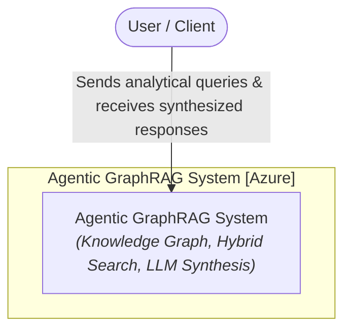
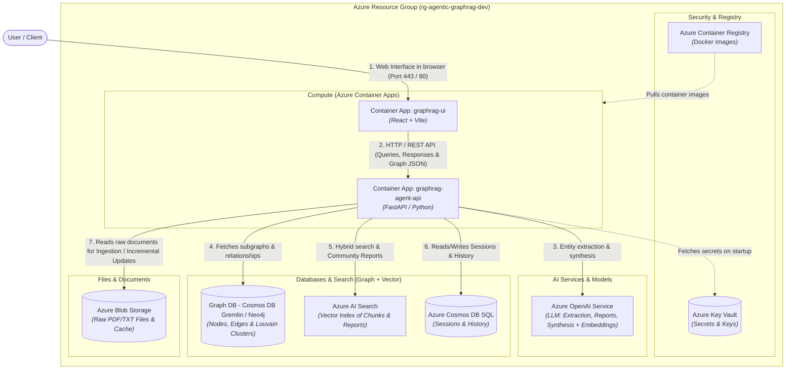
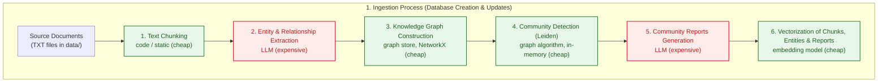
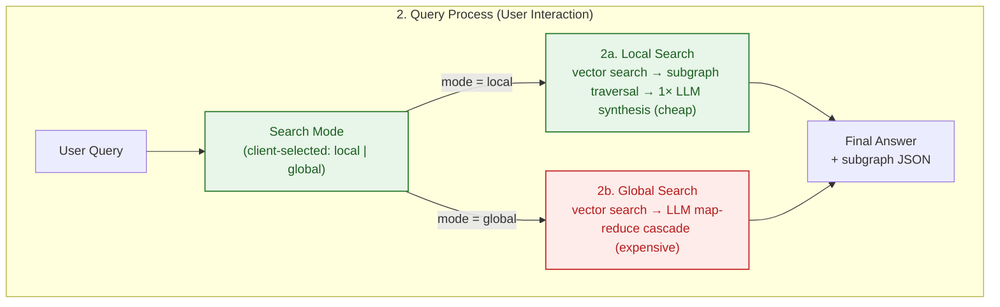

<p align="center">
  <a href="../README.md">English</a> ·
  <a href="README.zh-CN.md">中文</a> ·
  <a href="README.pl.md">Polski</a> ·
  <strong>Español</strong> ·
  <a href="README.ja.md">日本語</a> ·
  <a href="README.ko.md">한국어</a> ·
  <a href="README.ru.md">Русский</a> ·
  <a href="README.fr.md">Français</a> ·
  <a href="README.de.md">Deutsch</a>
</p>

## Agentic GraphRAG Blueprint

Arquitectura de referencia para una solución Agentic GraphRAG (grafo de conocimiento + búsqueda vectorial) desplegada en Microsoft Azure mediante Terraform (IaC), FastAPI y React.

Este repositorio es un punto de partida listo para construir sistemas que responden preguntas sobre grandes colecciones de documentos no estructurados. A diferencia de la recuperación simple, que devuelve fragmentos aislados, combina un grafo de conocimiento con búsqueda vectorial para que un agente pueda conectar hechos de muchos documentos, por ejemplo, rastrear cómo un tema de un informe se relaciona con los hallazgos de otro. La ingesta es incremental, por lo que el corpus puede crecer sin reprocesar todo desde cero y sin que el coste de tokens se dispare.

Es más útil en dominios intensivos en conocimiento donde las respuestas dependen de la síntesis entre documentos más que de una coincidencia única: literatura científica y médica, documentos legales y regulatorios, documentación de productos e incidentes, y flujos de investigación que preguntan "¿cómo se relacionan estas cosas?" en lugar de "¿dónde está esta frase?".

El diseño apunta a encajar en el futuro. El enrutamiento agéntico de búsqueda local/global se adapta a la complejidad de cada pregunta. Las abstracciones de almacenamiento (`AbstractGraphStore`, `AbstractVectorStore`) mantienen intercambiables los backends de grafo y vectorial a medida que evolucionan las necesidades. Todo el stack está definido en Terraform con un pipeline de CI/CD, por lo que pasar de un prototipo a un despliegue escalable en Azure es posible. A medida que los corpus crecen y los costes de los LLM bajan, la recuperación basada en grafos de conocimiento es hacia donde se dirige el RAG.

<div align="center">
  
  <p><em>Interfaz de la aplicación Agentic GraphRAG</em></p>
</div>

## Arquitectura (modelo C4)
### Nivel 1: Diagrama de contexto del sistema
Visión general de la interacción del usuario con el sistema Agentic GraphRAG.



### Nivel 2: Diagrama de contenedores
Vista de los componentes de infraestructura mapeados a recursos de Azure definidos en Terraform.



## Flujos de procesamiento

### 1. Proceso de ingesta (creación y actualizaciones incrementales de la base de datos)



### 2. Proceso de consulta (interacción del usuario)



### Costes y complejidad de un vistazo

El coste lo dominan las llamadas LLM; los pasos locales (fragmentación, algoritmos de grafo, embeddings) son prácticamente gratuitos a esta escala.

| Paso | Origen del coste | Coste relativo |
|---|---|---|
| Fragmentación de texto | CPU, O(caracteres) | insignificante |
| Extracción de entidades y relaciones | tokens LLM, una llamada por fragmento | alto (coste principal) |
| Construcción del grafo | CPU, en memoria | insignificante |
| Detección de comunidades (Leiden) | CPU, ~lineal en aristas | insignificante |
| Informes de comunidades | tokens LLM, por comunidad | alto |
| Embeddings | tokens + llamadas API, en lotes | bajo |
| Consulta local | 1 llamada de síntesis LLM | bajo |
| Consulta global | cascada map-reduce LLM | medio-alto |

- **El coste de ingesta crece con el número de archivos *modificados***, no con el tamaño del corpus: los documentos sin cambios se omiten mediante hash de contenido y los informes de comunidades solo se regeneran para las comunidades afectadas.
- **El coste de consulta crece con la pregunta**, no con el tamaño del corpus: `local` cuesta ~1 llamada LLM, `global` una pequeña cascada map-reduce sobre los informes más relevantes.

## Características principales

- Ingesta incremental: los documentos nuevos se fragmentan, se extraen en entidades y relaciones y se fusionan en el grafo de conocimiento sin reprocesar los archivos existentes. El re-agrupamiento Leiden se ejecuta en memoria y los informes de comunidades solo se regeneran para las comunidades afectadas, manteniendo bajo el coste de tokens a medida que crece el corpus.

- Recuperación híbrida: cada consulta puede usar Local Search (búsqueda vectorial más recorrido del grafo a nivel de entidad para respuestas detalladas) o Global Search (resumen map-reduce sobre informes de comunidades para síntesis entre documentos).

- Grafo de conocimiento + índice vectorial: los documentos se convierten en un grafo de entidades y relaciones respaldado por NetworkX, junto con un índice vectorial ChromaDB sobre fragmentos, entidades e informes. Ambos almacenes son intercambiables mediante `AbstractGraphStore` y `AbstractVectorStore`.

- Prompts independientes del dominio: todos los system prompts LLM (extracción, informes de comunidades, búsqueda local/global) viven en `backend/prompts.json` con valores por defecto universales. Copia ese archivo, edita las cadenas `system` y establece `PROMPTS_PATH` para adaptar el asistente a cualquier dominio.

- Visualizador interactivo del grafo: los subgrafos devueltos por la búsqueda se renderizan en vivo en la UI para que puedas inspeccionar cómo se ensambló una respuesta.

## Inicio rápido

El repositorio incluye un prototipo ejecutable: un backend FastAPI (`backend/`) y un frontend React (`frontend/`).

### Requisitos previos
- `OPENAI_API_KEY` en el archivo `.env` de la raíz (copia de `.env.example`)

### Ejecución

```bash
docker compose up --build
```

- UI del frontend: http://localhost:5173
- API del backend: http://localhost:8000 (docs en `/docs`)

Para eliminar todo localmente (contenedores, imágenes, volúmenes):

```bash
docker compose down --rmi all -v --remove-orphans
```

## Despliegue en la nube

La arquitectura de referencia se despliega en Azure con Terraform. No se ingiere ningún dato en la nube: los recursos se aprovisionan vacíos y listos para cargar documentos desde la UI.

### Despliegue local

```bash
make bootstrap   # crea el backend de estado y el service principal
make apply       # aprovisiona todo el entorno
```

Con GitHub Actions en su lugar: ejecuta `make bootstrap`, copia los valores impresos en **Settings → Secrets and variables → Actions** y haz push a `main`; el workflow aprovisiona Azure y despliega las imágenes del backend y el frontend.

Los cambios solo de documentación (`README.md`, `images/`, `data/`, `Makefile`, cambios de versión en `frontend/package.json`) omiten el pipeline automáticamente, y añadir `[skip ci]` al mensaje de commit lo omite manualmente. Usa el botón **Run workflow** en la pestaña Actions para desplegar manualmente cuando una ejecución se haya omitido.

Teardown: `make destroy-all` elimina todos los recursos, el backend de estado y el service principal.

> [!NOTE]
> El frontend usa autenticación Entra ID, por lo que el service principal necesita el permiso `Application.ReadWrite.All` de Graph antes del primer apply; `make bootstrap` lo concede automáticamente.

## Futuras mejoras potenciales

La arquitectura deja deliberadamente margen para cambios que merecerán la pena a medida que los costes de los modelos sigan bajando y las ventanas de contexto crezcan:

- **Resolución semántica de entidades**: hoy las entidades se fusionan cuando el modelo reutiliza el mismo nombre. Modelos más baratos harán asequible una pasada de resolución dedicada (sinónimos, acrónimos, transliteraciones), fusionando muchos más nodos entre documentos.
- **Descomposición de consultas y razonamiento multi-hop**: dividir preguntas complejas en subconsultas respondidas contra diferentes regiones del grafo y luego sintetizar. Más llamadas LLM por consulta, pero respuestas mucho mejores a preguntas compuestas.
- **Arnés de evaluación**: un benchmark offline (conjuntos de preguntas + respuestas de referencia) para cuantificar cómo afectan los cambios de extracción, recuperación y prompts a la calidad de las respuestas.

## Citación

Si este repositorio te ha ayudado en tu investigación, siéntete libre de citarlo:

**Estilo APA**
> Brzustowicz, S. (2026). Agentic GraphRAG Blueprint: knowledge graphs and vector search for agentic question answering (Version 1.0.0) [Source code]. https://github.com/sebastianbrzustowicz/Agentic-GraphRAG-Blueprint

**BibTeX**
```bibtex
@software{brzustowicz_agentic_graphrag_blueprint_2026,
  author = {Sebastian Brzustowicz},
  title = {Agentic GraphRAG Blueprint: knowledge graphs and vector search for agentic question answering},
  url = {https://github.com/sebastianbrzustowicz/Agentic-GraphRAG-Blueprint},
  version = {1.0.0},
  year = {2026}
}
```
> [!TIP]
> También puedes usar el botón **"Cite this repository"** en la barra lateral para copiar automáticamente las citas o descargar el archivo de metadatos sin procesar.

## Licencia

Agentic-GraphRAG-Blueprint se publica bajo la licencia MIT.

## Autor

Sebastian Brzustowicz &lt;Se.Brzustowicz@gmail.com&gt;
