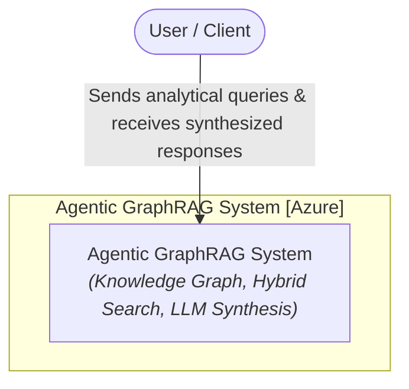
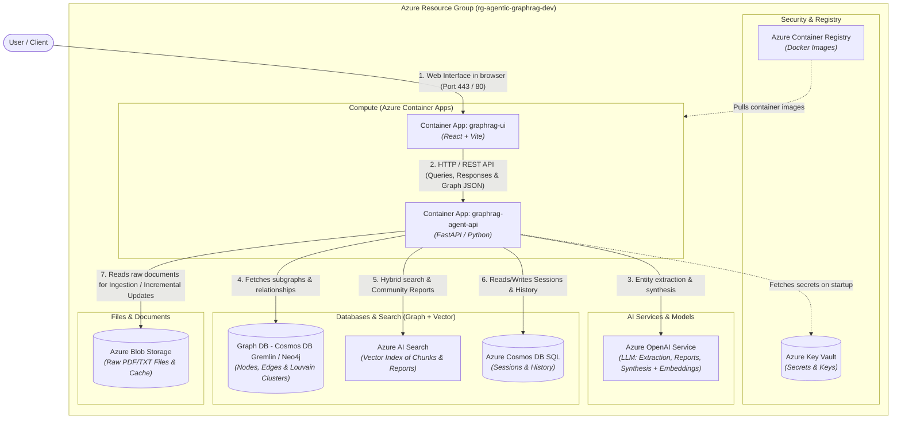
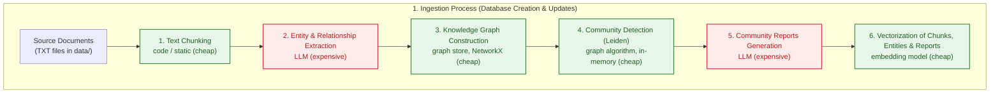
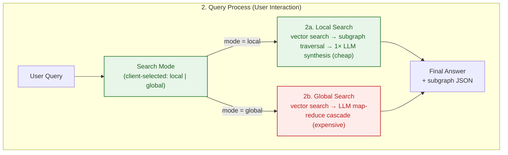

<p align="center">
  <a href="../README.md">English</a> ·
  <a href="README.zh-CN.md">中文</a> ·
  <a href="README.pl.md">Polski</a> ·
  <a href="README.es.md">Español</a> ·
  <a href="README.ja.md">日本語</a> ·
  <a href="README.ko.md">한국어</a> ·
  <a href="README.ru.md">Русский</a> ·
  <strong>Français</strong> ·
  <a href="README.de.md">Deutsch</a>
</p>

## Agentic GraphRAG Blueprint

Architecture de référence pour une solution Agentic GraphRAG (graphe de connaissances + recherche vectorielle) déployée sur Microsoft Azure avec Terraform (IaC), FastAPI et React.

Ce dépôt est un point de départ prêt à l'emploi pour construire des systèmes qui répondent à des questions sur de grandes collections de documents non structurés. Contrairement à la recherche simple, qui renvoie des extraits isolés, il combine un graphe de connaissances avec la recherche vectorielle afin qu'un agent puisse relier des faits issus de nombreux documents - par exemple, tracer comment un sujet d'un rapport se rapporte aux conclusions d'un autre. L'ingestion est incrémentale : le corpus peut donc grandir sans tout retraiter depuis zéro et sans que le coût en jetons explose.

Il est le plus utile dans les domaines à forte intensité de connaissances où les réponses dépendent d'une synthèse entre documents plutôt que d'une correspondance unique : littérature scientifique et médicale, documents juridiques et réglementaires, documentation produit et incidents, ainsi que les flux de recherche qui demandent « comment ces éléments sont-ils liés ? » plutôt que « où se trouve cette phrase ? ».

Le design vise à s'inscrire dans l'avenir. Le routage agentique de recherche local/global s'adapte à la complexité de chaque question. Les abstractions de stockage (`AbstractGraphStore`, `AbstractVectorStore`) permettent de permuter les backends de graphe et vectoriel à mesure que les besoins évoluent. Toute la pile est définie en Terraform avec un pipeline CI/CD, donc passer d'un prototype à un déploiement scalable sur Azure est possible. À mesure que les corpus de documents grandissent et que le coût des LLM baisse, la recherche fondée sur les graphes de connaissances est la direction du RAG.

<div align="center">
  
  <p><em>Interface de l'application Agentic GraphRAG</em></p>
</div>

## Architecture (modèle C4)
### Niveau 1 : diagramme de contexte système
Vue d'ensemble de l'interaction de l'utilisateur avec le système Agentic GraphRAG.



### Niveau 2 : diagramme de conteneurs
Vue des composants d'infrastructure mappés sur les ressources Azure définies dans Terraform.



## Flux de traitement

### 1. Processus d'ingestion (création de la base et mises à jour incrémentales)



### 2. Processus de requête (interaction utilisateur)



### Coûts et complexité en un coup d'œil

Les coûts sont dominés par les appels LLM ; les étapes locales (découpage, algorithmes de graphe, embeddings) sont quasiment gratuites à cette échelle.

| Étape | Source de coût | Coût relatif |
|---|---|---|
| Découpage du texte | CPU, O(caractères) | négligeable |
| Extraction d'entités et relations | jetons LLM, un appel par morceau | élevé (coût principal) |
| Construction du graphe | CPU, en mémoire | négligeable |
| Détection de communautés (Leiden) | CPU, ~linéaire en arêtes | négligeable |
| Rapports de communautés | jetons LLM, par communauté | élevé |
| Embeddings | jetons + appels API, par lots | faible |
| Requête locale | 1 appel de synthèse LLM | faible |
| Requête globale | cascade map-reduce LLM | moyen-élevé |

- **Le coût d'ingestion augmente avec le nombre de fichiers *modifiés***, pas avec la taille du corpus : les documents inchangés sont ignorés via un hachage du contenu et les rapports de communautés ne sont régénérés que pour les communautés affectées.
- **Le coût de requête augmente avec la question**, pas avec la taille du corpus : `local` coûte ~1 appel LLM, `global` une petite cascade map-reduce sur les rapports les plus pertinents.

## Fonctionnalités principales

- Ingestion incrémentale : les nouveaux documents sont découpés, extraits en entités et relations, puis fusionnés dans le graphe sans retraiter les fichiers existants. Le re-clustering Leiden s'exécute en mémoire et les rapports de communautés ne sont régénérés que pour les communautés affectées, ce qui maintient le coût en jetons faible à mesure que le corpus grandit.

- Recherche hybride : chaque requête peut utiliser la recherche locale (recherche vectorielle plus parcours du graphe au niveau des entités pour des réponses détaillées) ou la recherche globale (synthèse map-reduce sur les rapports de communautés pour une synthèse entre documents).

- Graphe de connaissances + index vectoriel : les documents deviennent un graphe d'entités et de relations reposant sur NetworkX, aux côtés d'un index vectoriel ChromaDB sur les morceaux, entités et rapports. Les deux stockages sont permutables via `AbstractGraphStore` et `AbstractVectorStore`.

- Prompts indépendants du domaine : tous les system prompts LLM (extraction, rapports de communautés, recherche local/global) vivent dans `backend/prompts.json` avec des valeurs par défaut universelles. Copiez ce fichier, modifiez les chaînes `system` et définissez `PROMPTS_PATH` pour adapter l'assistant à n'importe quel domaine.

- Visualiseur de graphe interactif : les sous-graphes renvoyés par la recherche sont rendus en direct dans l'interface, afin d'inspecter comment une réponse a été assemblée.

## Démarrage rapide

Le dépôt inclut un prototype exécutable : un backend FastAPI (`backend/`) et un frontend React (`frontend/`).

### Prérequis
- `OPENAI_API_KEY` dans le fichier `.env` racine (copie de `.env.example`)

### Exécution

```bash
docker compose up --build
```

- UI du frontend : http://localhost:5173
- API du backend : http://localhost:8000 (docs sur `/docs`)

Pour tout supprimer localement (conteneurs, images, volumes) :

```bash
docker compose down --rmi all -v --remove-orphans
```

## Déploiement cloud

L'architecture de référence se déploie sur Azure avec Terraform. Aucune donnée n'est ingérée dans le cloud : les ressources sont provisionnées vides et prêtes à charger des documents depuis l'interface.

### Déploiement local

```bash
make bootstrap   # crée le backend d'état et le service principal
make apply       # provisionne tout l'environnement
```

Avec GitHub Actions : exécutez `make bootstrap`, copiez les valeurs affichées dans **Settings → Secrets and variables → Actions**, puis poussez sur `main` — le workflow provisionne Azure et déploie les images du backend et du frontend.

Un push normal n'exécute que le job lint & test. Ajouter `[cloud]` au message de commit exécute aussi Terraform et déploie sur Azure ; `[skip ci]` ignore entièrement le pipeline, et les changements purement documentaires (`README.md`, `images/`, `data/`, `Makefile`) sont filtrés automatiquement. Utilisez le bouton **Run workflow** dans l'onglet Actions pour déployer manuellement.

Teardown : `make destroy-all` supprime toutes les ressources, le backend d'état et le service principal.

> [!NOTE]
> Le frontend utilise l'authentification Entra ID, donc le service principal a besoin de la permission Graph `Application.ReadWrite.All` avant le premier apply — `make bootstrap` l'accorde automatiquement.

## Améliorations futures potentielles

L'architecture laisse délibérément de la marge pour des changements qui deviendront intéressants à mesure que les coûts des modèles baissent et que les fenêtres de contexte grandissent :

- **Résolution sémantique des entités** : aujourd'hui les entités sont fusionnées lorsque le modèle réutilise le même nom. Des modèles moins chers rendront abordable une passe de résolution dédiée (synonymes, acronymes, translittérations), fusionnant bien plus de nœuds entre documents.
- **Décomposition des requêtes et raisonnement multi-sauts** : diviser les questions complexes en sous-requêtes traitées contre différentes régions du graphe, puis synthétiser. Plus d'appels LLM par requête, mais des réponses nettement meilleures aux questions composées.
- **Harnais d'évaluation** : un benchmark hors ligne (ensembles de questions + réponses de référence) pour quantifier l'impact des changements d'extraction, de recherche et de prompts sur la qualité des réponses.

## Citation

Si ce dépôt vous a aidé dans vos recherches, n'hésitez pas à le citer :

**Style APA**
> Brzustowicz, S. (2026). Agentic GraphRAG Blueprint: knowledge graphs and vector search for agentic question answering (Version 1.0.1) [Source code]. https://github.com/sebastianbrzustowicz/Agentic-GraphRAG-Blueprint

**BibTeX**
```bibtex
@software{brzustowicz_agentic_graphrag_blueprint_2026,
  author = {Sebastian Brzustowicz},
  title = {Agentic GraphRAG Blueprint: knowledge graphs and vector search for agentic question answering},
  url = {https://github.com/sebastianbrzustowicz/Agentic-GraphRAG-Blueprint},
  version = {1.0.1},
  year = {2026}
}
```
> [!TIP]
> Vous pouvez aussi utiliser le bouton **"Cite this repository"** dans la barre latérale pour copier automatiquement les citations ou télécharger le fichier de métadonnées brut.

## Licence

Agentic-GraphRAG-Blueprint est publié sous licence MIT.

## Auteur

Sebastian Brzustowicz &lt;Se.Brzustowicz@gmail.com&gt;
