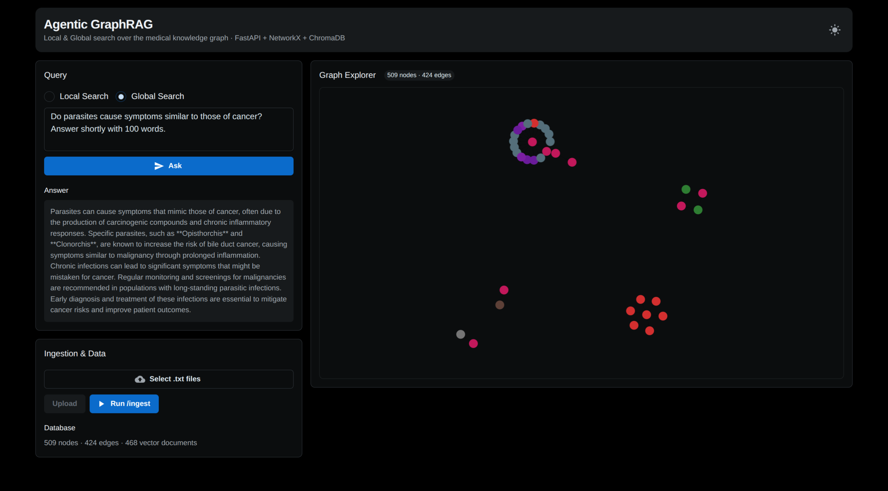
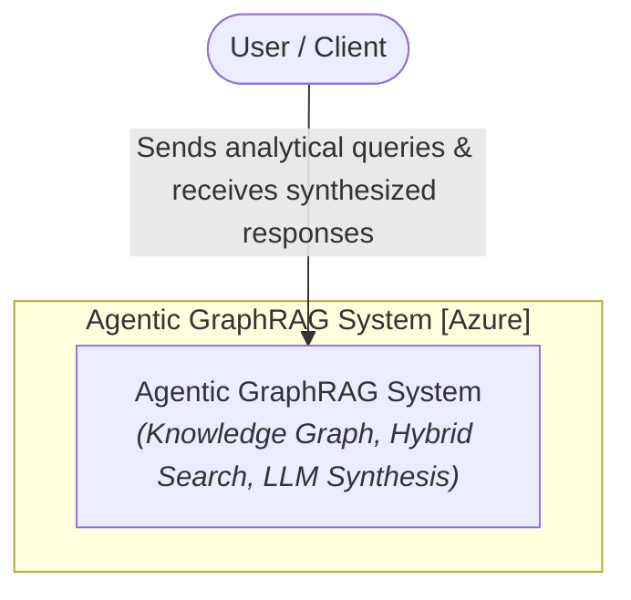
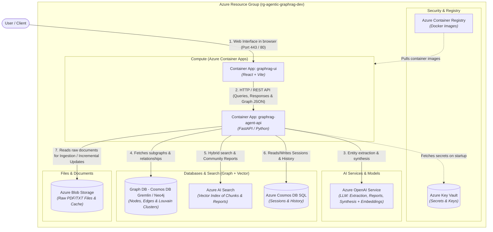
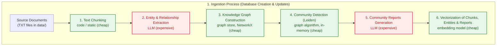
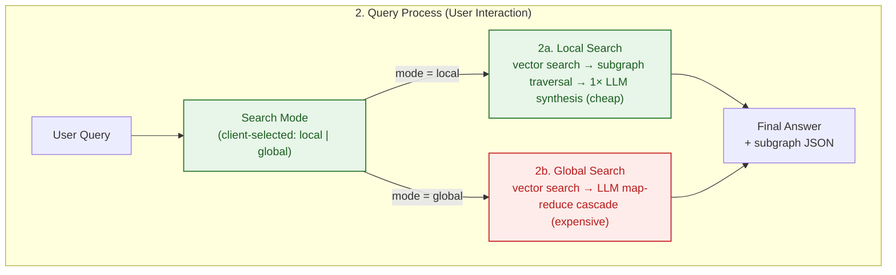

<p align="center">
  <a href="../README.md">English</a> ·
  <a href="README.zh-CN.md">中文</a> ·
  <a href="README.pl.md">Polski</a> ·
  <a href="README.es.md">Español</a> ·
  <strong>日本語</strong> ·
  <a href="README.ko.md">한국어</a> ·
  <a href="README.ru.md">Русский</a> ·
  <a href="README.fr.md">Français</a> ·
  <a href="README.de.md">Deutsch</a>
</p>

## Agentic GraphRAG Blueprint

Microsoft Azure に Terraform（IaC）、FastAPI、React を使用してデプロイされた Agentic GraphRAG（知識グラフ + ベクトル検索）ソリューションのリファレンスアーキテクチャです。

このリポジトリは、大規模な非構造化ドキュメントコレクションに対して質問応答するシステムを構築するための、すぐ使える出発点です。孤立したスニペットだけを返す単純な検索とは異なり、知識グラフとベクトル検索を組み合わせ、エージェントが複数のドキュメントにまたがる事実を結び付けられるようにします。たとえば、あるレポートのトピックが別のレポートの調査結果とどう関連するかを追跡できます。取り込みはインクリメンタルなので、コーパスはゼロから再処理することなく成長でき、トークンコストが爆発することもありません。

回答が単一の一致ではなくドキュメント横断的な統合に依存する知識集約型ドメインで最も役立ちます。科学・医学文献、法規制文書、製品・インシデント文書、そして「このフレーズはどこにあるか」ではなく「これらはどう関連しているか」を問う研究ワークフローなどです。

デザインは未来に適合することを目指しています。エージェント型の local/global 検索ルーティングは質問の複雑さに適応します。ストア抽象化（`AbstractGraphStore`、`AbstractVectorStore`）により、ニーズの進化に応じてグラフ・ベクトルバックエンドを交換できます。スタック全体は Terraform で定義され CI/CD パイプラインを備えているため、プロトタイプから Azure 上のスケーラブルなデプロイへの移行が可能です。ドキュメントコーパスが成長し続け、LLM コストが下がり続けるにつれ、知識グラフベースの検索こそが RAG の向かう先です。

<div align="center">
  
  <p><em>Agentic GraphRAG アプリケーション UI</em></p>
</div>

## アーキテクチャ（C4 モデル）
### レベル 1: システムコンテキスト図
Agentic GraphRAG システムとのユーザー対話の概要。



### レベル 2: コンテナ図
Terraform で定義された Azure リソースにマッピングされたインフラストラクチャコンポーネントのビュー。



## 処理ワークフロー

### 1. 取り込みプロセス（データベース作成とインクリメンタル更新）



### 2. クエリプロセス（ユーザー対話）



### コストと計算複雑度の概要

コストの大部分は LLM 呼び出しによるものです。ローカル処理（チャンク分割、グラフアルゴリズム、埋め込み）はこの規模では実質無料です。

| ステップ | コスト要因 | 相対コスト |
|---|---|---|
| テキスト分割 | CPU、O(文字数) | 無視できる |
| エンティティ・関係抽出 | LLM トークン、チャンクごとに 1 呼び出し | 高（主要コスト） |
| 知識グラフ構築 | CPU、インメモリ | 無視できる |
| コミュニティ検出（Leiden） | CPU、辺数にほぼ線形 | 無視できる |
| コミュニティレポート | LLM トークン、コミュニティごと | 高 |
| 埋め込み | トークン + API 呼び出し、バッチ処理 | 低 |
| ローカル検索 | LLM 合成 1 回 | 低 |
| グローバル検索 | LLM map-reduce カスケード | 中〜高 |

- **取り込みコストは *変更された* ファイル数に比例**し、コーパスサイズには比例しません。未変更のドキュメントはコンテンツハッシュでスキップされ、コミュニティレポートは影響を受けたコミュニティのみ再生成されます。
- **クエリコストは質問に比例**し、コーパスサイズには比例しません。`local` は LLM 呼び出し約 1 回、`global` は最も関連性の高いレポートに対する小さな map-reduce カスケードです。

## 主な機能

- インクリメンタル取り込み：新しいドキュメントはチャンク分割され、エンティティと関係に抽出され、既存ファイルを再処理することなく知識グラフにマージされます。Leiden の再クラスタリングはインメモリで実行され、コミュニティレポートは影響を受けたコミュニティのみ再生成されるため、コーパスが成長しても LLM トークンコストを低く抑えられます。

- ハイブリッド検索：各クエリは、詳細な事実レベルの回答のためのローカル検索（ベクトル検索 + エンティティレベルのグラフ走査）か、ドキュメント横断的な統合のためのグローバル検索（コミュニティレポートの map-reduce 要約）を使用できます。

- 知識グラフ + ベクトルインデックス：ドキュメントは NetworkX を基盤とするエンティティ・関係グラフになり、チャンク・エンティティ・レポートを対象とする ChromaDB ベクトルインデックスと並行します。両ストアは `AbstractGraphStore` と `AbstractVectorStore` で交換可能です。

- ドメイン非依存のプロンプト：すべての LLM システムプロンプト（抽出、コミュニティレポート、local/global 検索）は `backend/prompts.json` にあり、汎用のデフォルトが設定されています。このファイルをコピーして `system` 文字列を編集し、`PROMPTS_PATH` を設定すれば、アシスタントを任意のドメインに合わせられます。

- インタラクティブなグラフ可視化：検索が返すサブグラフは UI にライブで描画されるため、回答がどのように組み立てられたかを確認できます。

## クイックスタート

このリポジトリには実行可能なプロトタイプが同梱されています：FastAPI バックエンド（`backend/`）と React フロントエンド（`frontend/`）。

### 前提条件
- ルートの `.env` ファイルの `OPENAI_API_KEY`（`.env.example` のコピー）

### 実行

```bash
docker compose up --build
```

- フロントエンド UI: http://localhost:5173
- バックエンド API: http://localhost:8000（ドキュメントは `/docs`）

ローカルを完全に削除するには（コンテナ、イメージ、ボリューム）：

```bash
docker compose down --rmi all -v --remove-orphans
```

## クラウドデプロイ

リファレンスアーキテクチャは Terraform で Azure にデプロイされます。クラウドではデータは取り込まれません。リソースは空の状態でプロビジョニングされ、UI からドキュメントを読み込む準備ができています。

### ローカルデプロイ

```bash
make bootstrap   # ステートバックエンドと service principal を作成
make apply       # 環境全体をプロビジョニング
```

GitHub Actions を使う場合：`make bootstrap` を実行し、表示された値を **Settings → Secrets and variables → Actions** にコピーして `main` にプッシュします。ワークフローが Azure をプロビジョニングし、バックエンドとフロントエンドのイメージをデプロイします。

通常のプッシュでは lint & test ジョブのみが実行されます。コミットメッセージに `[cloud]` を追加すると Terraform も実行され Azure にデプロイされます。`[skip ci]` はパイプライン全体をスキップし、ドキュメントのみの変更（`README.md`、`images/`、`data/`、`Makefile`、`frontend/package.json` のバージョン変更）は自動的に除外されます。手動でデプロイするには Actions タブの **Run workflow** ボタンを使用します。

破棄：`make destroy-all` はすべてのリソース、ステートバックエンド、service principal を削除します。

> [!NOTE]
> フロントエンドは Entra ID 認証を使用するため、最初の apply の前に service principal に `Application.ReadWrite.All` Graph 権限が必要です。`make bootstrap` が自動的に付与します。

## 将来の改善候補

このアーキテクチャは、モデルコストの低下とコンテキストウィンドウの拡大に伴って価値が高まる変更の余地を意図的に残しています：

- **セマンティックなエンティティ解決**：現在、エンティティはモデルが同じ名前を再利用したときにのみ統合されます。モデルが安価になれば、専用の解決パス（同義語、略語、翻字）が実現可能になり、ドキュメント横断でさらに多くのノードを統合できます。
- **クエリ分解とマルチホップ推論**：複雑な質問をグラフの異なる領域に対するサブクエリに分割し、結果を合成します。クエリあたりの LLM 呼び出しは増えますが、複合的な質問への回答は劇的に向上します。
- **評価ハーネス**：オフラインのベンチマーク（質問セット + 参照回答）で、抽出・検索・プロンプトの変更が回答品質に与える影響を定量的に測定します。

## 引用

このリポジトリが研究の役に立った場合は、自由に引用してください：

**APA スタイル**
> Brzustowicz, S. (2026). Agentic GraphRAG Blueprint: knowledge graphs and vector search for agentic question answering (Version 1.0.0) [Source code]. https://github.com/sebastianbrzustowicz/Agentic-GraphRAG-Blueprint

**BibTeX**
```bibtex
@software{brzustowicz_agentic_graphrag_blueprint_2026,
  author = {Sebastian Brzustowicz},
  title = {Agentic GraphRAG Blueprint: knowledge graphs and vector search for agentic question answering},
  url = {https://github.com/sebastianbrzustowicz/Agentic-GraphRAG-Blueprint},
  version = {1.0.0},
  year = {2026}
}
```
> [!TIP]
> サイドバーの **"Cite this repository"** ボタンを使えば、引用を自動的にコピーしたり、生のメタデータファイルをダウンロードしたりできます。

## ライセンス

Agentic-GraphRAG-Blueprint は MIT ライセンスで公開されています。

## 作者

Sebastian Brzustowicz &lt;Se.Brzustowicz@gmail.com&gt;
