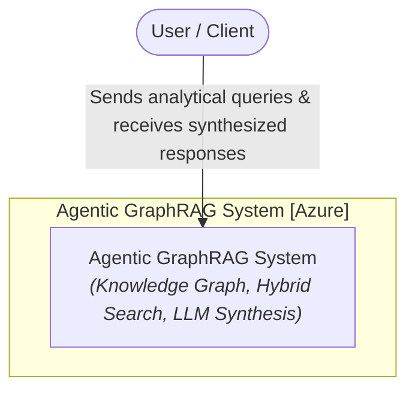
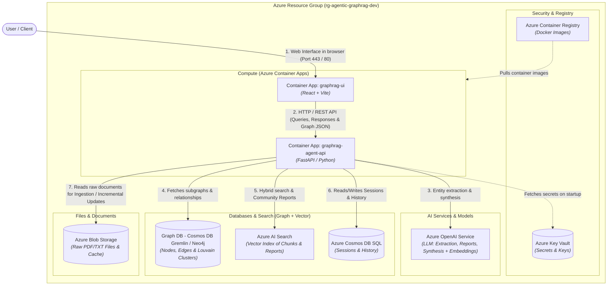
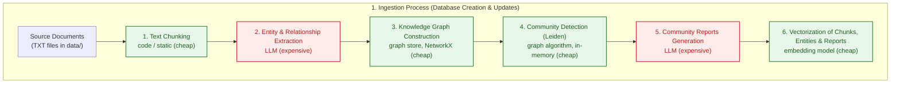
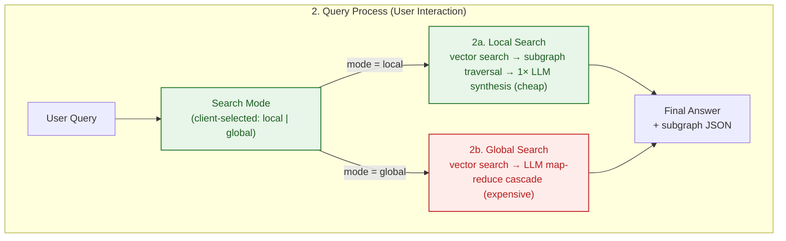

<p align="center">
  <a href="../README.md">English</a> ·
  <a href="README.zh-CN.md">中文</a> ·
  <a href="README.pl.md">Polski</a> ·
  <a href="README.es.md">Español</a> ·
  <a href="README.ja.md">日本語</a> ·
  <strong>한국어</strong> ·
  <a href="README.ru.md">Русский</a> ·
  <a href="README.fr.md">Français</a> ·
  <a href="README.de.md">Deutsch</a>
</p>

## Agentic GraphRAG Blueprint

Microsoft Azure에 Terraform(IaC), FastAPI, React를 사용해 배포하는 Agentic GraphRAG(지식 그래프 + 벡터 검색) 솔루션의 레퍼런스 아키텍처입니다.

이 리포지토리는 대규모 비정형 문서 컬렉션에 대한 질문 응답 시스템을 구축하기 위한 즉시 사용 가능한 출발점입니다. 고립된 스니펫만 반환하는 단순 검색과 달리, 지식 그래프와 벡터 검색을 결합하여 에이전트가 여러 문서에 걸친 사실을 연결할 수 있게 합니다. 예를 들어 한 보고서의 주제가 다른 보고서의 조사 결과와 어떻게 관련되는지 추적할 수 있습니다. 수집은 증분 방식이므로 코퍼스는 처음부터 다시 처리할 필요 없이 성장할 수 있으며 토큰 비용이 폭발하지 않습니다.

단일 일치보다는 문서 간 종합에 답변이 의존하는 지식 집약적 분야에서 가장 유용합니다. 과학·의학 문헌, 법률·규제 문서, 제품·사고 문서, 그리고 "이 문구가 어디 있나요?"보다 "이것들이 어떻게 관련되나요?"를 묻는 연구 워크플로 등이 해당합니다.

디자인은 미래에 맞춰질 것을 목표로 합니다. 에이전트형 local/global 검색 라우팅은 각 질문의 복잡성에 적응합니다. 저장소 추상화(`AbstractGraphStore`, `AbstractVectorStore`)는 요구사항이 진화함에 따라 그래프/벡터 백엔드를 교체할 수 있게 합니다. 전체 스택은 Terraform으로 정의되고 CI/CD 파이프라인을 갖추고 있어 프로토타입에서 Azure의 확장 가능한 배포로 이동하는 것이 가능합니다. 문서 코퍼스가 계속 커지고 LLM 비용이 계속 낮아짐에 따라 지식 그래프 기반 검색이 바로 RAG가 나아가는 방향입니다.

<div align="center">
  
  <p><em>Agentic GraphRAG 애플리케이션 UI</em></p>
</div>

## 아키텍처(C4 모델)
### 레벨 1: 시스템 컨텍스트 다이어그램
Agentic GraphRAG 시스템과 사용자 상호작용의 개요입니다.



### 레벨 2: 컨테이너 다이어그램
Terraform으로 정의된 Azure 리소스에 매핑된 인프라 구성 요소의 뷰입니다.



## 처리 워크플로

### 1. 수집 프로세스(데이터베이스 생성 및 증분 업데이트)



### 2. 쿼리 프로세스(사용자 상호작용)



### 비용 및 계산 복잡도 요약

비용의 대부분은 LLM 호출에서 발생합니다. 로컬 단계(청크 분할, 그래프 알고리즘, 임베딩)는 이 규모에서 사실상 무료입니다.

| 단계 | 비용 요인 | 상대 비용 |
|---|---|---|
| 텍스트 청크 분할 | CPU, O(문자 수) | 무시 가능 |
| 엔티티·관계 추출 | LLM 토큰, 청크당 1회 호출 | 높음(주요 비용) |
| 지식 그래프 구축 | CPU, 인메모리 | 무시 가능 |
| 커뮤니티 탐지(Leiden) | CPU, 간선 수에 거의 선형 | 무시 가능 |
| 커뮤니티 보고서 | LLM 토큰, 커뮤니티당 | 높음 |
| 임베딩 | 토큰 + API 호출, 배치 처리 | 낮음 |
| 로컬 검색 | LLM 종합 호출 1회 | 낮음 |
| 글로벌 검색 | LLM map-reduce 캐스케이드 | 중간~높음 |

- **수집 비용은 *변경된* 파일 수에 비례**하며 코퍼스 크기에는 비례하지 않습니다. 변경되지 않은 문서는 콘텐츠 해시로 건너뛰고, 커뮤니티 보고서는 영향받은 커뮤니티에 대해서만 다시 생성됩니다.
- **쿼리 비용은 질문에 비례**하며 코퍼스 크기에는 비례하지 않습니다. `local`은 LLM 호출 약 1회, `global`은 가장 관련성 높은 보고서에 대한 소규모 map-reduce 캐스케이드입니다.

## 핵심 기능

- 증분 수집: 새 문서는 청크로 분할되고 엔티티와 관계로 추출되어 기존 파일을 다시 처리하지 않고 지식 그래프에 병합됩니다. Leiden 재클러스터링은 인메모리로 실행되고 커뮤니티 보고서는 영향받은 커뮤니티에 대해서만 다시 생성되므로 코퍼스가 커져도 LLM 토큰 비용이 낮게 유지됩니다.

- 하이브리드 검색: 각 쿼리는 로컬 검색(벡터 검색 + 엔티티 수준 그래프 탐색으로 상세한 사실 기반 답변) 또는 글로벌 검색(커뮤니티 보고서의 map-reduce 요약으로 문서 간 종합)을 사용할 수 있습니다.

- 지식 그래프 + 벡터 인덱스: 문서는 NetworkX 기반의 엔티티·관계 그래프가 되며, 청크·엔티티·보고서에 대한 ChromaDB 벡터 인덱스와 함께 운영됩니다. 두 저장소는 `AbstractGraphStore`와 `AbstractVectorStore`로 교체할 수 있습니다.

- 도메인 무관 프롬프트: 모든 LLM 시스템 프롬프트(추출, 커뮤니티 보고서, local/global 검색)는 `backend/prompts.json`에 범용 기본값으로 들어 있습니다. 이 파일을 복사해 `system` 문자열을 편집하고 `PROMPTS_PATH`를 설정하면 어시스턴트를 어떤 도메인에도 맞출 수 있습니다.

- 대화형 그래프 시각화: 검색이 반환한 서브그래프가 UI에 실시간으로 렌더링되어 답변이 어떻게 조립되었는지 확인할 수 있습니다.

## 빠른 시작

이 리포지토리에는 실행 가능한 프로토타입이 포함되어 있습니다: FastAPI 백엔드(`backend/`)와 React 프론트엔드(`frontend/`).

### 사전 요구사항
- 루트 `.env` 파일의 `OPENAI_API_KEY`(`.env.example`의 복사본)

### 실행

```bash
docker compose up --build
```

- 프론트엔드 UI: http://localhost:5173
- 백엔드 API: http://localhost:8000(문서는 `/docs`)

로컬의 모든 것을 제거하려면(컨테이너, 이미지, 볼륨):

```bash
docker compose down --rmi all -v --remove-orphans
```

## 클라우드 배포

레퍼런스 아키텍처는 Terraform으로 Azure에 배포됩니다. 클라우드에서는 데이터가 수집되지 않습니다. 리소스는 빈 상태로 프로비저닝되며 UI에서 문서를 로드할 준비가 되어 있습니다.

### 로컬 배포

```bash
make bootstrap   # 상태 백엔드와 service principal 생성
make apply       # 전체 환경 프로비저닝
```

GitHub Actions를 사용하는 경우: `make bootstrap`을 실행하고 출력된 값을 **Settings → Secrets and variables → Actions**에 복사한 뒤 `main`에 푸시합니다. 워크플로가 Azure를 프로비저닝하고 백엔드·프론트엔드 이미지를 배포합니다.

문서 전용 변경(`README.md`, `images/`, `data/`, `Makefile`, `frontend/package.json`의 버전 변경)은 파이프라인을 자동으로 건너뛰며, 커밋 메시지에 `[skip ci]`를 추가하면 수동으로 건너뜁니다. 건너뛴 실행을 수동으로 배포하려면 Actions 탭의 **Run workflow** 버튼을 사용하세요.

정리: `make destroy-all`은 모든 리소스, 상태 백엔드, service principal을 삭제합니다.

> [!NOTE]
> 프론트엔드는 Entra ID 인증을 사용하므로 service principal은 첫 apply 전에 `Application.ReadWrite.All` Graph 권한이 필요합니다. `make bootstrap`이 자동으로 부여합니다.

## 향후 잠재적 개선

이 아키텍처는 모델 비용이 계속 낮아지고 컨텍스트 창이 계속 커짐에 따라 가치가 생기는 변경을 위한 여지를 의도적으로 남겨 둡니다:

- **의미론적 엔티티 해석**: 현재 엔티티는 모델이 동일한 이름을 재사용할 때만 병합됩니다. 모델이 저렴해지면 전용 해석 패스(동의어, 약어, 음역)가 가능해져 문서 간에 훨씬 더 많은 노드를 병합할 수 있습니다.
- **쿼리 분해 및 멀티홉 추론**: 복잡한 질문을 그래프의 서로 다른 영역에 대한 하위 쿼리로 나눈 뒤 종합합니다. 쿼리당 LLM 호출은 늘지만 복합 질문에 대한 답변 품질은 크게 향상됩니다.
- **평가 하네스**: 오프라인 벤치마크(질문 세트 + 참조 답변)로 추출·검색·프롬프트 변경이 답변 품질에 미치는 영향을 정량화합니다.

## 인용

이 리포지토리가 연구에 도움이 되었다면 자유롭게 인용해 주세요:

**APA 스타일**
> Brzustowicz, S. (2026). Agentic GraphRAG Blueprint: knowledge graphs and vector search for agentic question answering (Version 1.0.0) [Source code]. https://github.com/sebastianbrzustowicz/Agentic-GraphRAG-Blueprint

**BibTeX**
```bibtex
@software{brzustowicz_agentic_graphrag_blueprint_2026,
  author = {Sebastian Brzustowicz},
  title = {Agentic GraphRAG Blueprint: knowledge graphs and vector search for agentic question answering},
  url = {https://github.com/sebastianbrzustowicz/Agentic-GraphRAG-Blueprint},
  version = {1.0.0},
  year = {2026}
}
```
> [!TIP]
> 사이드바의 **"Cite this repository"** 버튼을 사용하면 인용을 자동으로 복사하거나 원본 메타데이터 파일을 다운로드할 수 있습니다.

## 라이선스

Agentic-GraphRAG-Blueprint는 MIT 라이선스로 배포됩니다.

## 저자

Sebastian Brzustowicz &lt;Se.Brzustowicz@gmail.com&gt;
