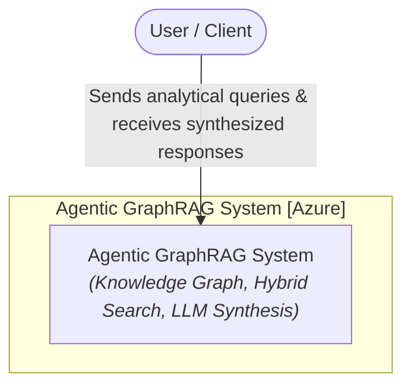
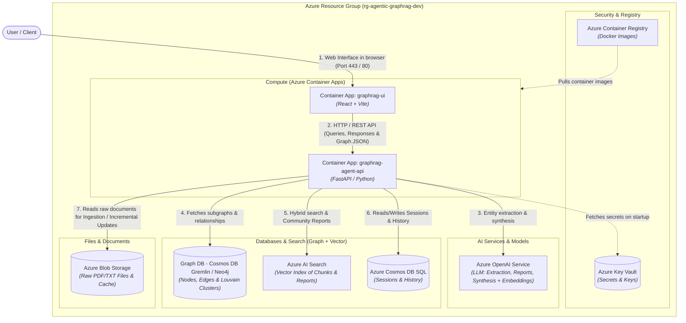
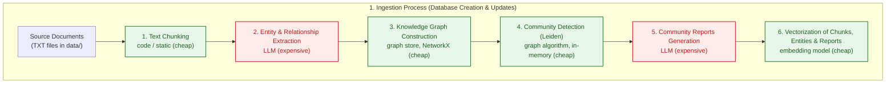
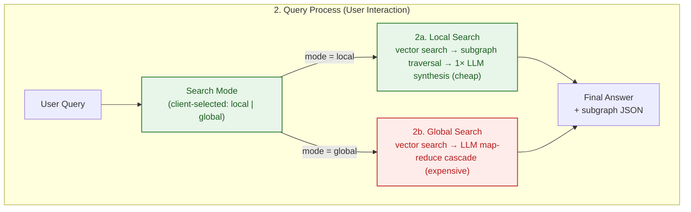

<p align="center">
  <a href="../README.md">English</a> ·
  <a href="README.zh-CN.md">中文</a> ·
  <strong>Polski</strong> ·
  <a href="README.es.md">Español</a> ·
  <a href="README.ja.md">日本語</a> ·
  <a href="README.ko.md">한국어</a> ·
  <a href="README.ru.md">Русский</a> ·
  <a href="README.fr.md">Français</a> ·
  <a href="README.de.md">Deutsch</a>
</p>

## Agentic GraphRAG Blueprint

Architektura referencyjna rozwiązania Agentic GraphRAG (graf wiedzy + wyszukiwanie wektorowe) wdrożonego na Microsoft Azure przy użyciu Terraform (IaC), FastAPI i React.

To repozytorium to gotowy punkt startowy do budowania systemów odpowiadających na pytania na podstawie dużych, nieustrukturyzowanych zbiorów dokumentów. W przeciwieństwie do zwykłego wyszukiwania, które zwraca pojedyncze fragmenty, łączy graf wiedzy z wyszukiwaniem wektorowym, dzięki czemu agent może wiązać fakty z wielu dokumentów - na przykład śledzić, jak temat z jednego raportu odnosi się do ustaleń w innym. Ingest jest przyrostowy, więc korpus może rosnąć bez ponownego przetwarzania wszystkiego od zera i bez eksplodujących kosztów tokenów.

Najbardziej przydaje się w dziedzinach opartych na wiedzy, gdzie odpowiedzi zależą od syntezy między dokumentami, a nie pojedynczego dopasowania: literatura naukowa i medyczna, dokumenty prawne i regulacyjne, dokumentacja produktów i incydentów oraz przepływy badawcze, które pytają „jak te rzeczy się ze sobą wiążą?" zamiast „gdzie jest ten fragment?".

Projekt celuje w to, aby wpasować się w przyszłość. Agentowy routing wyszukiwania local/global dostosowuje się do złożoności pytania. Abstrakcje store'ów (`AbstractGraphStore`, `AbstractVectorStore`) pozwalają wymieniać backendy grafu i wektorów w miarę ewolucji potrzeb. Cały stack jest zdefiniowany w Terraform z pipeline'em CI/CD, więc przejście od prototypu do skalowalnego wdrożenia na Azure jest możliwe. Wraz z rosnącymi korpusami dokumentów i spadającymi kosztami LLM, wyszukiwanie oparte na grafach wiedzy to kierunek, w którym zmierza RAG.

<div align="center">
  
  <p><em>Interfejs aplikacji Agentic GraphRAG</em></p>
</div>

## Architektura (model C4)
### Poziom 1: Diagram kontekstu systemu
Ogólny przegląd interakcji użytkownika z systemem Agentic GraphRAG.



### Poziom 2: Diagram kontenerów
Widok komponentów infrastruktury odwzorowanych na zasoby Azure zdefiniowane w Terraform.



## Przepływy przetwarzania

### 1. Proces ingestu (tworzenie i aktualizacje bazy)



### 2. Proces zapytania (interakcja użytkownika)



### Koszty i złożoność w skrócie

Koszty zdominowane są przez wywołania LLM; kroki lokalne (chunking, algorytmy grafowe, embeddingi) są na tym poziomie praktycznie darmowe.

| Krok | Źródło kosztu | Koszt względny |
|---|---|---|
| Chunking | CPU, O(znaków) | pomijalny |
| Ekstrakcja encji i relacji | tokeny LLM, jedno wywołanie na chunk | wysoki (główny koszt) |
| Budowa grafu wiedzy | CPU, w pamięci | pomijalny |
| Detekcja community (Leiden) | CPU, ~liniowo z krawędziami | pomijalny |
| Raporty community | tokeny LLM, na community | wysoki |
| Embeddingi | tokeny + wywołania API, batchowane | niski |
| Zapytanie lokalne | 1 wywołanie syntezy LLM | niski |
| Zapytanie globalne | kaskada map-reduce LLM | średnio-wysoki |

- **Koszt ingestu rośnie z liczbą *zmienionych* plików**, nie z wielkością korpusu: niezmienione dokumenty są pomijane na podstawie hasha treści, a raporty community są generowane ponownie tylko dla dotkniętych community.
- **Koszt zapytania rośnie z pytaniem**, nie z wielkością korpusu: `local` kosztuje ~1 wywołanie LLM, `global` małą kaskadę map-reduce po najbardziej istotnych raportach.

## Główne funkcje

- Ingest przyrostowy: nowe dokumenty są dzielone na chunki, ekstrahowane do encji i relacji oraz scalane z grafem wiedzy bez ponownego przetwarzania istniejących plików. Re-klastrowanie Leiden działa w pamięci, a raporty community są generowane ponownie tylko dla dotkniętych community, co utrzymuje niskie koszty tokenów wraz ze wzrostem korpusu.

- Hybrydowe wyszukiwanie: każde zapytanie może użyć Local Search (wyszukiwanie wektorowe plus traversal grafu na poziomie encji dla szczegółowych odpowiedzi) lub Global Search (synteza map-reduce po raportach community dla odpowiedzi łączących wiele dokumentów).

- Graf wiedzy + indeks wektorowy: dokumenty stają się grafem encji i relacji opartym na NetworkX, obok indeksu wektorowego ChromaDB nad chunkami, encjami i raportami. Oba store'y można wymieniać przez `AbstractGraphStore` i `AbstractVectorStore`.

- Prompty niezależne od domeny: wszystkie system prompty LLM (ekstrakcja, raporty community, wyszukiwanie local/global) znajdują się w `backend/prompts.json` z uniwersalnymi domyślnymi wartościami. Skopiuj ten plik, edytuj stringi `system` i ustaw `PROMPTS_PATH`, aby dostosować asystenta do dowolnej domeny.

- Interaktywny wizualizator grafu: subgrafy zwracane przez wyszukiwanie są renderowane na żywo w UI, więc możesz sprawdzić, jak została złożona odpowiedź.

## Szybki start

Repozytorium zawiera działający prototyp: backend FastAPI (`backend/`) i frontend React (`frontend/`).

### Wymagania wstępne
- `OPENAI_API_KEY` w pliku `.env` w katalogu głównym (kopia z `.env.example`)

### Uruchomienie

```bash
docker compose up --build
```

- UI frontendu: http://localhost:5173
- API backendu: http://localhost:8000 (dokumentacja pod `/docs`)

Aby usunąć wszystko lokalnie (kontenery, obrazy, wolumeny):

```bash
docker compose down --rmi all -v --remove-orphans
```

## Wdrożenie w chmurze

Architektura referencyjna wdraża się na Azure za pomocą Terraform. W chmurze nie jest ingestowane żadne dane - zasoby są provisionowane puste i gotowe na załadowanie dokumentów z UI.

### Wdrożenie lokalne

```bash
make bootstrap   # tworzy backend stanu i service principal
make apply       # provisionuje całe środowisko
```

Alternatywnie przez GitHub Actions: uruchom `make bootstrap`, skopiuj wypisane wartości do **Settings → Secrets and variables → Actions** i wypchnij na `main` - workflow provisionuje Azure i wdraża obrazy backendu i frontendu.

Zwykły push uruchamia tylko zadanie lint & test. Dodanie `[cloud]` do treści commita uruchamia również Terraform i wdraża na Azure; `[skip ci]` pomija pipeline w całości, a zmiany tylko dokumentacyjne (`README.md`, `images/`, `data/`, `Makefile`, zmiany wersji w `frontend/package.json`) są filtrowane automatycznie. Użyj przycisku **Run workflow** w zakładce Actions, aby wdrożyć ręcznie.

Teardown: `make destroy-all` usuwa wszystkie zasoby, backend stanu i service principal.

> [!NOTE]
> Frontend używa uwierzytelniania Entra ID, więc service principal potrzebuje uprawnienia `Application.ReadWrite.All` Graph przed pierwszym apply - `make bootstrap` nadaje je automatycznie.

## Przyszłe potencjalne ulepszenia

Architektura celowo zostawia zapas na zmiany, które staną się opłacalne, gdy koszty modeli będą spadać, a okna kontekstu rosnąć:

- **Semantyczna rezolucja encji** - dziś encje są scalane, gdy model użyje tej samej nazwy. Tańsze modele umożliwią dedykowany przebieg rezolucji (synonimy, akronimy, transliteracje), scalając znacznie więcej węzłów między dokumentami.
- **Dekompozycja zapytań i rozumowanie wielokrokowe** - rozbijanie złożonych pytań na pod-zapytania odpowiadane względem różnych regionów grafu, a następnie synteza. Więcej wywołań LLM na zapytanie, ale znacznie lepsze odpowiedzi na pytania złożone.
- **Harness ewaluacyjny** - benchmark offline (zestawy pytań + odpowiedzi referencyjne) do ilościowego określenia, jak zmiany ekstrakcji, wyszukiwania i promptów wpływają na jakość odpowiedzi.

## Cytowanie

Jeśli to repozytorium pomogło Ci w badaniach, możesz je zacytować:

**Styl APA**
> Brzustowicz, S. (2026). Agentic GraphRAG Blueprint: knowledge graphs and vector search for agentic question answering (Version 1.0.1) [Source code]. https://github.com/sebastianbrzustowicz/Agentic-GraphRAG-Blueprint

**BibTeX**
```bibtex
@software{brzustowicz_agentic_graphrag_blueprint_2026,
  author = {Sebastian Brzustowicz},
  title = {Agentic GraphRAG Blueprint: knowledge graphs and vector search for agentic question answering},
  url = {https://github.com/sebastianbrzustowicz/Agentic-GraphRAG-Blueprint},
  version = {1.0.1},
  year = {2026}
}
```
> [!TIP]
> Możesz też użyć przycisku **"Cite this repository"** na pasku bocznym, aby automatycznie skopiować cytowania lub pobrać surowy plik metadanych.

## Licencja

Agentic-GraphRAG-Blueprint jest wydany na licencji MIT.

## Autor

Sebastian Brzustowicz &lt;Se.Brzustowicz@gmail.com&gt;
