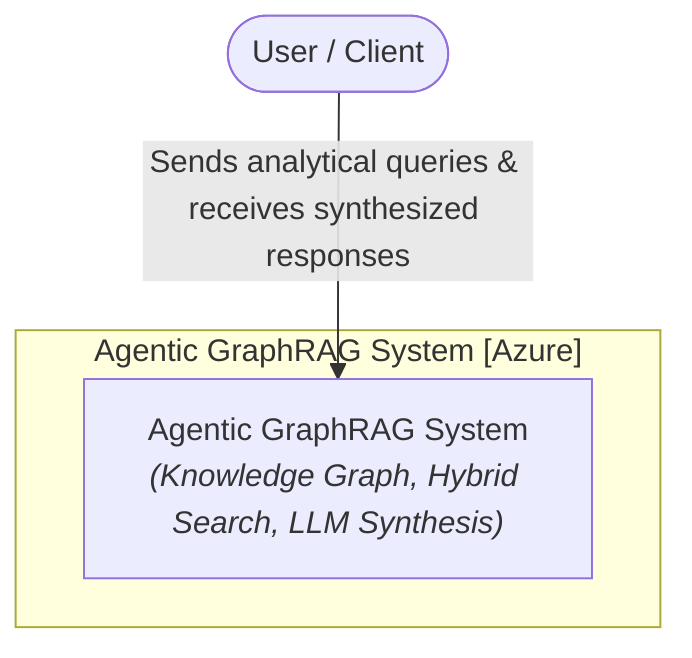
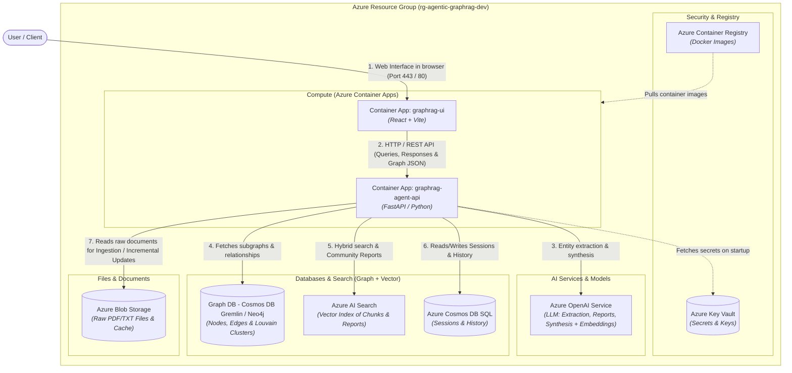
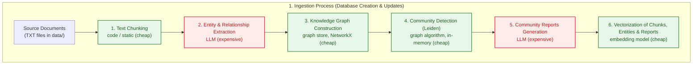
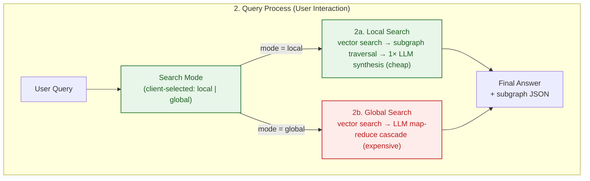

<p align="center">
  <a href="../README.md">English</a> ·
  <a href="README.zh-CN.md">中文</a> ·
  <a href="README.pl.md">Polski</a> ·
  <a href="README.es.md">Español</a> ·
  <a href="README.ja.md">日本語</a> ·
  <a href="README.ko.md">한국어</a> ·
  <strong>Русский</strong> ·
  <a href="README.fr.md">Français</a> ·
  <a href="README.de.md">Deutsch</a>
</p>

## Agentic GraphRAG Blueprint

Эталонная архитектура решения Agentic GraphRAG (граф знаний + векторный поиск), развёрнутого на Microsoft Azure с использованием Terraform (IaC), FastAPI и React.

Этот репозиторий — готовый отправной пункт для создания систем, отвечающих на вопросы по большим неструктурированным коллекциям документов. В отличие от простого поиска, возвращающего изолированные фрагменты, он сочетает граф знаний с векторным поиском, позволяя агенту связывать факты из множества документов — например, проследить, как тема одного отчёта соотносится с выводами другого. Индексация инкрементальна, поэтому корпус может расти без повторной обработки с нуля и без взрывного роста затрат на токены.

Наиболее полезен в сферах, где ответы зависят от синтеза между документами, а не от единичного совпадения: научная и медицинская литература, юридические и нормативные документы, документация по продуктам и инцидентам, а также исследовательские рабочие процессы, которые спрашивают «как эти вещи связаны между собой?» вместо «где находится эта фраза?».

Дизайн нацелен на соответствие будущему. Агентная маршрутизация поиска local/global адаптируется к сложности вопроса. Абстракции хранилищ (`AbstractGraphStore`, `AbstractVectorStore`) позволяют заменять графовые и векторные бэкенды по мере развития потребностей. Весь стек определён в Terraform с CI/CD-конвейером, поэтому переход от прототипа к масштабируемому развёртыванию на Azure возможен. По мере роста корпусов документов и снижения стоимости LLM поиск на основе графов знаний — это направление, в котором движется RAG.

<div align="center">
  
  <p><em>Интерфейс приложения Agentic GraphRAG</em></p>
</div>

## Архитектура (модель C4)
### Уровень 1: диаграмма контекста системы
Обзор взаимодействия пользователя с системой Agentic GraphRAG.



### Уровень 2: диаграмма контейнеров
Вид компонентов инфраструктуры, сопоставленных с ресурсами Azure, определёнными в Terraform.



## Рабочие процессы

### 1. Процесс индексации (создание базы данных и инкрементальные обновления)



### 2. Процесс запроса (взаимодействие с пользователем)



### Стоимость и сложность вкратце

Основную часть затрат составляют вызовы LLM; локальные шаги (разбиение на чанки, графовые алгоритмы, эмбеддинги) на этом масштабе практически бесплатны.

| Шаг | Источник затрат | Относительная стоимость |
|---|---|---|
| Разбиение текста на чанки | CPU, O(символов) | пренебрежимо мала |
| Извлечение сущностей и связей | токены LLM, один вызов на чанк | высокая (основные затраты) |
| Построение графа знаний | CPU, в памяти | пренебрежимо мала |
| Обнаружение сообществ (Leiden) | CPU, ~линейно от рёбер | пренебрежимо мала |
| Отчёты по сообществам | токены LLM, на сообщество | высокая |
| Эмбеддинги | токены + вызовы API, пакетно | низкая |
| Локальный запрос | 1 вызов синтеза LLM | низкая |
| Глобальный запрос | каскад map-reduce LLM | средне-высокая |

- **Стоимость индексации растёт с числом *изменённых* файлов**, а не с размером корпуса: неизменённые документы пропускаются по хэшу содержимого, а отчёты по сообществам пересоздаются только для затронутых сообществ.
- **Стоимость запроса растёт с вопросом**, а не с размером корпуса: `local` стоит ~1 вызов LLM, `global` — небольшой каскад map-reduce по наиболее релевантным отчётам.

## Ключевые возможности

- Инкрементальная индексация: новые документы разбиваются на чанки, извлекаются в сущности и связи и объединяются в граф знаний без повторной обработки существующих файлов. Перекластеризация Leiden выполняется в памяти, а отчёты по сообществам пересоздаются только для затронутых сообществ, что удерживает низкие затраты на токены по мере роста корпуса.

- Гибридный поиск: каждый запрос может использовать локальный поиск (векторный поиск плюс обход графа на уровне сущностей для детальных ответов) или глобальный поиск (map-reduce суммаризация по отчётам сообществ для синтеза между документами).

- Граф знаний + векторный индекс: документы становятся графом сущностей и связей на базе NetworkX, дополненным векторным индексом ChromaDB по чанкам, сущностям и отчётам. Оба хранилища заменяемы через `AbstractGraphStore` и `AbstractVectorStore`.

- Доменно-независимые промпты: все системные промпты LLM (извлечение, отчёты по сообществам, поиск local/global) находятся в `backend/prompts.json` с универсальными значениями по умолчанию. Скопируйте этот файл, отредактируйте строки `system` и задайте `PROMPTS_PATH`, чтобы адаптировать ассистента к любой предметной области.

- Интерактивный визуализатор графа: подграфы, возвращаемые поиском, рендерятся в UI в реальном времени, так что можно увидеть, как был собран ответ.

## Быстрый старт

Репозиторий содержит работающий прототип: бэкенд FastAPI (`backend/`) и фронтенд React (`frontend/`).

### Предварительные требования
- `OPENAI_API_KEY` в корневом файле `.env` (копия из `.env.example`)

### Запуск

```bash
docker compose up --build
```

- UI фронтенда: http://localhost:5173
- API бэкенда: http://localhost:8000 (документация на `/docs`)

Чтобы удалить всё локально (контейнеры, образы, тома):

```bash
docker compose down --rmi all -v --remove-orphans
```

## Развёртывание в облаке

Эталонная архитектура развёртывается на Azure с помощью Terraform. В облаке данные не индексируются: ресурсы провижинятся пустыми и готовыми к загрузке документов из UI.

### Локальное развёртывание

```bash
make bootstrap   # создаёт state backend и service principal
make apply       # провижинит всё окружение
```

Вместо этого через GitHub Actions: выполните `make bootstrap`, скопируйте выведенные значения в **Settings → Secrets and variables → Actions** и запушьте в `main` — workflow провижинит Azure и развернёт образы бэкенда и фронтенда.

Изменения только в документации (`README.md`, `images/`, `data/`, `Makefile`, изменения версии в `frontend/package.json`) автоматически пропускают конвейер, а добавление `[skip ci]` в сообщение коммита пропускает его вручную. Используйте кнопку **Run workflow** на вкладке Actions, чтобы развернуть вручную, если запуск был пропущен.

Удаление: `make destroy-all` удаляет все ресурсы, state backend и service principal.

> [!NOTE]
> Фронтенд использует аутентификацию Entra ID, поэтому service principal требует разрешения `Application.ReadWrite.All` Graph до первого apply — `make bootstrap` выдаёт его автоматически.

## Возможные будущие улучшения

Архитектура намеренно оставляет запас для изменений, которые станут целесообразными по мере снижения стоимости моделей и роста контекстных окон:

- **Семантическое разрешение сущностей**: сегодня сущности объединяются, когда модель повторно использует одно и то же имя. Более дешёвые модели сделают доступным отдельный проход разрешения (синонимы, аббревиатуры, транслитерации), объединяя значительно больше узлов между документами.
- **Декомпозиция запросов и многошаговое рассуждение**: разбиение сложных вопросов на подзапросы к разным областям графа с последующей синтезацией. Больше вызовов LLM на запрос, но заметно лучшие ответы на составные вопросы.
- **Оценочный стенд**: офлайн-бенчмарк (наборы вопросов + эталонные ответы) для количественной оценки влияния изменений извлечения, поиска и промптов на качество ответов.

## Цитирование

Если этот репозиторий помог вам в исследованиях, вы можете процитировать его:

**Стиль APA**
> Brzustowicz, S. (2026). Agentic GraphRAG Blueprint: knowledge graphs and vector search for agentic question answering (Version 1.0.0) [Source code]. https://github.com/sebastianbrzustowicz/Agentic-GraphRAG-Blueprint

**BibTeX**
```bibtex
@software{brzustowicz_agentic_graphrag_blueprint_2026,
  author = {Sebastian Brzustowicz},
  title = {Agentic GraphRAG Blueprint: knowledge graphs and vector search for agentic question answering},
  url = {https://github.com/sebastianbrzustowicz/Agentic-GraphRAG-Blueprint},
  version = {1.0.0},
  year = {2026}
}
```
> [!TIP]
> Вы также можете использовать кнопку **"Cite this repository"** на боковой панели, чтобы автоматически скопировать цитирования или скачать исходный файл метаданных.

## Лицензия

Agentic-GraphRAG-Blueprint распространяется под лицензией MIT.

## Автор

Sebastian Brzustowicz &lt;Se.Brzustowicz@gmail.com&gt;
