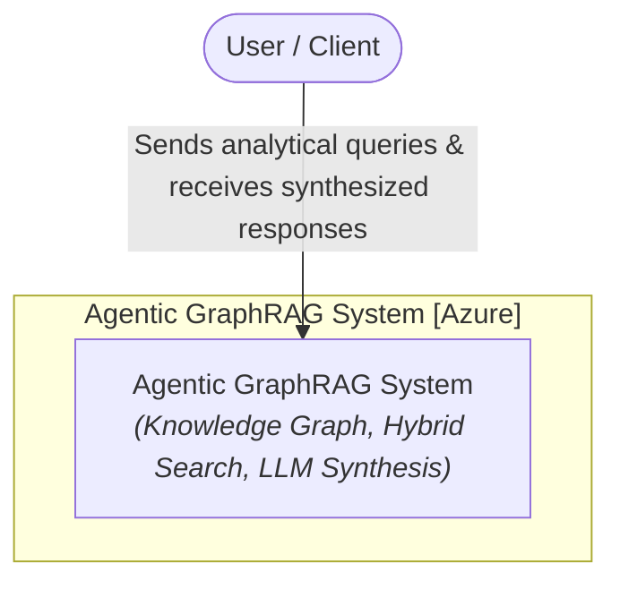
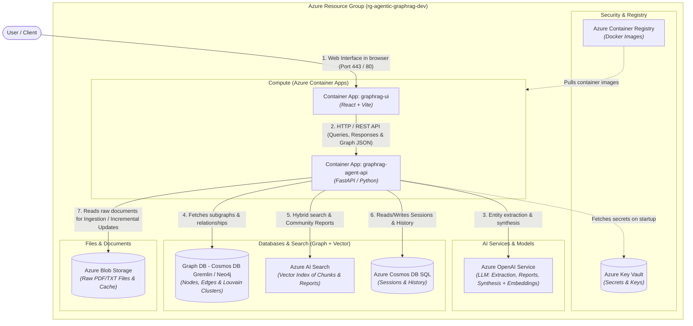
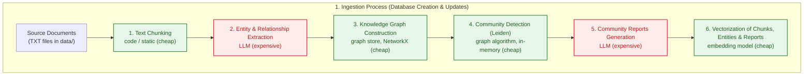
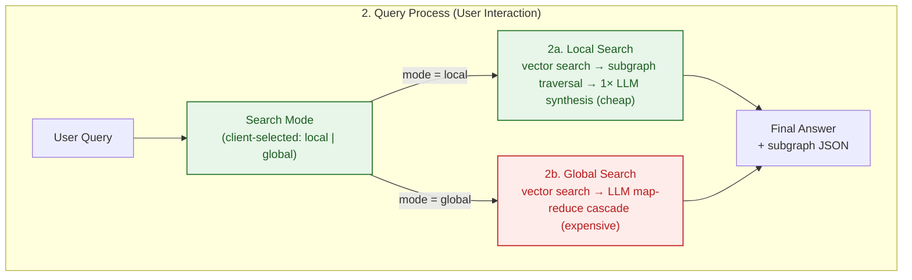

<p align="center">
  <a href="../README.md">English</a> ·
  <strong>中文</strong> ·
  <a href="README.pl.md">Polski</a> ·
  <a href="README.es.md">Español</a> ·
  <a href="README.ja.md">日本語</a> ·
  <a href="README.ko.md">한국어</a> ·
  <a href="README.ru.md">Русский</a> ·
  <a href="README.fr.md">Français</a> ·
  <a href="README.de.md">Deutsch</a>
</p>

## Agentic GraphRAG Blueprint

Agentic GraphRAG（知识图谱 + 向量检索）解决方案的参考架构，基于 Microsoft Azure，使用 Terraform（IaC）、FastAPI 和 React 部署。

本仓库是为大型非结构化文档集合构建问答系统的现成起点。与只返回孤立片段的普通检索不同，它将知识图谱与向量检索结合，使智能体能够跨文档关联事实——例如追踪一份报告中的主题与另一份报告中的结论有何联系。摄取是增量的，因此语料库可以增长，而无需从头重新处理，也不会导致 token 成本爆炸。

它最适合答案依赖跨文档综合而非单一匹配的知识密集型领域：科学与医学文献、法律与监管文件、产品与事故文档，以及提出"这些东西之间有何关联？"而非"这个短语在哪里？"的研究工作流。

设计旨在面向未来。基于智能体的 local/global 搜索路由会根据问题的复杂度自适应。存储抽象（`AbstractGraphStore`、`AbstractVectorStore`）让图和向量后端可以随需求演进而替换。整个技术栈由 Terraform 定义并配有 CI/CD 流水线，因此从原型到 Azure 上的可扩展部署是可行的。随着文档语料库不断增长、LLM 成本不断下降，基于知识图谱的检索正是 RAG 的发展方向。

<div align="center">
  
  <p><em>Agentic GraphRAG 应用界面</em></p>
</div>

## 架构（C4 模型）
### 第 1 层：系统上下文图
用户与 Agentic GraphRAG 系统交互的高层概览。



### 第 2 层：容器图
基础设施组件到 Terraform 定义的 Azure 资源的映射视图。



## 处理工作流

### 1. 摄取过程（数据库创建与增量更新）



### 2. 查询过程（用户交互）



### 成本与复杂度速览

成本主要由 LLM 调用构成；本地步骤（分块、图算法、向量化）在此规模下几乎免费。

| 步骤 | 成本来源 | 相对成本 |
|---|---|---|
| 文本分块 | CPU，O(字符数) | 可忽略 |
| 实体与关系抽取 | LLM token，每个分块一次调用 | 高（主要成本） |
| 知识图谱构建 | CPU，内存中 | 可忽略 |
| 社区检测（Leiden） | CPU，与边数近似线性 | 可忽略 |
| 社区报告 | LLM token，每个社区 | 高 |
| 向量化 | token + API 调用，批量 | 低 |
| 本地查询 | 1 次 LLM 综合调用 | 低 |
| 全局查询 | LLM map-reduce 级联 | 中-高 |

- **摄取成本随*变更*文件数量增长**，而非语料库大小：未变更文档通过内容哈希跳过，社区报告仅对受影响的社区重新生成。
- **查询成本随问题增长**，而非语料库大小：`local` 约 1 次 LLM 调用，`global` 是对最相关报告的一小段 map-reduce 级联。

## 核心特性

- 增量摄取：新文档被分块、抽取为实体和关系，并合并到知识图谱中，而无需重新处理现有文件。Leiden 重新聚类在内存中运行，社区报告仅对受影响的社区重新生成，使 LLM token 成本随语料库增长而保持低位。

- 混合检索：每个查询可以使用本地搜索（向量搜索 + 实体级图遍历，提供细节级答案）或全局搜索（基于社区报告的 map-reduce 摘要，用于跨文档综合）。

- 知识图谱 + 向量索引：文档通过 NetworkX 成为实体与关系图，并在分块、实体和报告之上建立 ChromaDB 向量索引。两种存储均可通过 `AbstractGraphStore` 和 `AbstractVectorStore` 替换。

- 领域无关提示词：所有 LLM 系统提示词（抽取、社区报告、local/global 搜索）都位于 `backend/prompts.json`，带有通用默认值。复制该文件，编辑 `system` 字符串并设置 `PROMPTS_PATH`，即可让助手适配任意领域。

- 交互式图谱可视化：搜索返回的子图在 UI 中实时渲染，便于检查答案是如何拼装出来的。

## 快速开始

仓库附带一个可运行的原型：FastAPI 后端（`backend/`）和 React 前端（`frontend/`）。

### 前置条件
- 根目录 `.env` 文件中的 `OPENAI_API_KEY`（复制自 `.env.example`）

### 运行

```bash
docker compose up --build
```

- 前端 UI：http://localhost:5173
- 后端 API：http://localhost:8000（文档在 `/docs`）

本地彻底清理（容器、镜像、卷）：

```bash
docker compose down --rmi all -v --remove-orphans
```

## 云部署

参考架构使用 Terraform 部署到 Azure。云端不会摄取任何数据——资源以空状态预置，随时可从 UI 加载文档。

### 本地部署

```bash
make bootstrap   # 创建状态后端和 service principal
make apply       # 预置整个环境
```

改用 GitHub Actions：运行 `make bootstrap`，将打印出的值复制到 **Settings → Secrets and variables → Actions**，然后推送到 `main`——工作流会预置 Azure 并部署前后端镜像。

仅文档类更改（`README.md`、`images/`、`data/`、`Makefile`、`frontend/package.json` 中的版本号）会自动跳过流水线，在提交信息中加入 `[skip ci]` 则可手动跳过。当某次运行被跳过时，可在 Actions 标签页使用 **Run workflow** 按钮手动部署。

拆除：`make destroy-all` 删除所有资源、状态后端和 service principal。

> [!NOTE]
> 前端使用 Entra ID 认证，因此 service principal 在首次 apply 前需要 `Application.ReadWrite.All` Graph 权限——`make bootstrap` 会自动授予。

## 未来潜在改进

架构刻意留有空间，以便在模型成本持续下降、上下文窗口不断增大时引入以下改进：

- **语义实体消解**——目前实体仅在模型复用相同名称时合并。更便宜的模型将使专门的消解过程（同义词、缩写、音译）变得可行，从而跨文档合并更多节点。
- **查询分解与多跳推理**——将复杂问题拆分为针对图谱不同区域的子查询，再综合答案。每次查询的 LLM 调用更多，但对复合问题的回答质量显著提升。
- **评估框架**——离线基准（问题集 + 参考答案），用于量化抽取、检索和提示词变化对答案质量的影响。

## 引用

如果本仓库对你的研究有帮助，欢迎引用：

**APA 格式**
> Brzustowicz, S. (2026). Agentic GraphRAG Blueprint: knowledge graphs and vector search for agentic question answering (Version 1.0.0) [Source code]. https://github.com/sebastianbrzustowicz/Agentic-GraphRAG-Blueprint

**BibTeX**
```bibtex
@software{brzustowicz_agentic_graphrag_blueprint_2026,
  author = {Sebastian Brzustowicz},
  title = {Agentic GraphRAG Blueprint: knowledge graphs and vector search for agentic question answering},
  url = {https://github.com/sebastianbrzustowicz/Agentic-GraphRAG-Blueprint},
  version = {1.0.0},
  year = {2026}
}
```
> [!TIP]
> 你也可以使用侧边栏中的 **"Cite this repository"** 按钮自动复制引用或下载原始元数据文件。

## 许可证

Agentic-GraphRAG-Blueprint 以 MIT 许可证发布。

## 作者

Sebastian Brzustowicz &lt;Se.Brzustowicz@gmail.com&gt;
